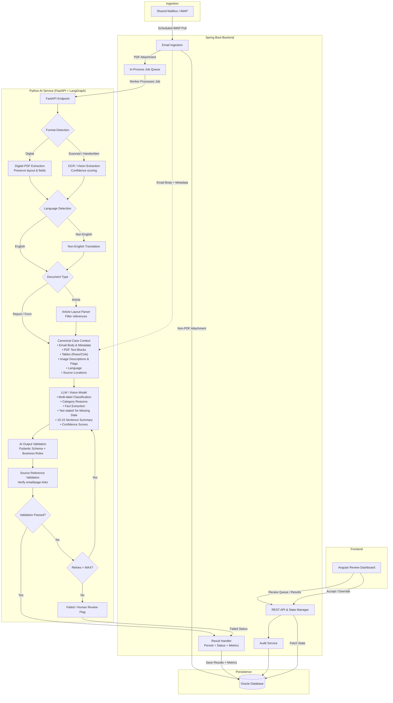

# High-Level Design (HLD)
## Smart Inbox Assistant — Clinevo Technologies Assignment

## 1. Overview

The Smart Inbox Assistant automates the first-pass processing of incoming healthcare emails and PDF attachments. The system ingests messages from a shared mailbox, processes PDF documents using format-aware extraction and AI, classifies the message into one or more relevant categories, extracts key facts with confidence and source references, and presents the results to a human reviewer through an Angular dashboard.

The design follows the assignment's suggested technology flow:

**Angular → Spring Boot → Python AI Service → Oracle Database**

An in-process asynchronous job queue is used because OCR and AI processing may take several seconds to a minute per document.

---

## 2. Architecture Diagram



---

## 3. Component Responsibilities

### 3.1 Shared Mailbox / IMAP

- Acts as the source of incoming messages.
- Spring Boot periodically performs a scheduled IMAP pull.
- Email sender, subject, date, body, and attachments are captured.
- PDF attachments are sent for processing.
- Non-PDF attachments are logged but not processed.

### 3.2 Spring Boot Backend

The Spring Boot application is responsible for orchestration, APIs, state management, persistence coordination, and audit handling.

**Email Ingestion**
- Connects to the test mailbox through IMAP.
- Retrieves email metadata, body, and attachments.
- Persists raw email information and attachment metadata.
- Creates asynchronous processing jobs for PDF attachments.

**REST API & State Manager**
- Provides APIs for the Angular review dashboard.
- Exposes processing state and AI results.
- Handles reviewer accept/override operations.

**In-Process Job Queue**
- Decouples mailbox ingestion from slow OCR/AI processing.
- Allows jobs to be processed asynchronously.
- Keeps the prototype simple without requiring an external messaging platform.

**Result Handler**
- Receives validated AI results.
- Persists results and processing metrics.
- Updates processing status.

**Audit Service**
- Records AI decisions and reviewer actions.
- Reviewer actions are timestamped for traceability.

### 3.3 Oracle Database

Oracle stores queryable application and audit data, including:

- Emails
- Attachments
- Processing jobs
- Processing status
- Classifications
- Extracted facts
- Confidence scores
- Source references
- Summaries
- Processing metrics
- Reviewer actions
- Audit records

### 3.4 Python AI Service

The Python service is exposed through FastAPI and uses LangGraph to orchestrate conditional document-processing steps.

#### Format Detection

Determines whether a PDF is:

- Digital
- Scanned / handwritten

#### Digital PDF Extraction

Uses PDF extraction tooling such as `pdfplumber` to:

- Extract text.
- Preserve layout where possible.
- Preserve form fields/labels and their relationships.
- Extract tables into structured rows and columns.

#### OCR / Vision Extraction

Handles scanned or handwritten PDFs.

- Uses OCR and/or a vision-capable model.
- Produces extracted text.
- Associates confidence with uncertain OCR results.
- Preserves source/page information.

#### Language Detection and Translation

- Detects the document language.
- Non-English documents are translated to English before downstream analysis.
- Original source information is retained so results can be traced back to the original document.

#### Article Layout Parser

Handles published articles.

- Accounts for multi-column layouts.
- Filters references and general discussion.
- Focuses downstream analysis on sections describing actual patient cases.

#### Canonical Case Context

Normalizes email and PDF content into a common representation before LLM analysis.

The canonical context contains:

- Email body and metadata
- PDF text blocks
- Structured tables
- Image descriptions and human-review flags
- Language
- Source locations

This allows the LLM to reason over the email and its processed attachments as a unified case context.

#### LLM / Vision Model

Produces structured AI analysis including:

- Multi-label classification
- Category-specific reasons
- Key fact extraction
- Confidence scores
- 10–15 sentence summary
- `"Not stated"` for information that is not present rather than guessing

The four classification categories are:

- ICSR / Safety Report
- PQC / Quality Complaint
- MI / Info Request
- Not Relevant

A message may receive more than one category.

#### AI Output Validation

Pydantic validates the structure of the AI response.

Business-rule validation checks that the response follows application requirements, such as:

- Required output fields are present.
- Confidence values are present.
- Missing information is represented as `"Not stated"`.
- Classification output follows the expected category structure.

#### Source Reference Validation

Every extracted fact must contain a source reference identifying where the information originated.

A source reference can identify:

- Email
- PDF attachment
- PDF page
- Source text/location

This supports auditability and reviewer verification.

#### Retry Handling

If validation fails:

1. The system checks the retry count.
2. If the retry count is below `MAX`, the LLM step is retried.
3. If the maximum retry count is reached, the document is marked failed and flagged for human review.

---

## 4. End-to-End Data Flow

1. **Scheduled IMAP Pull**  
   Spring Boot retrieves incoming messages from the shared mailbox.

2. **Persist Raw Data**  
   Email metadata, body, and attachments are persisted in Oracle.

3. **Create Processing Job**  
   PDF attachments create asynchronous jobs in the in-process queue.

4. **AI Processing**  
   A worker sends the processing job to the Python FastAPI service.

5. **Document Processing**  
   LangGraph routes the document through format detection, extraction/OCR, language handling, and document-type processing.

6. **Canonicalization**  
   Email information and processed PDF information are combined into the Canonical Case Context.

7. **AI Analysis**  
   The LLM performs multi-label classification, fact extraction, confidence scoring, category reasoning, and summary generation.

8. **Validation and Traceability**  
   Pydantic/business validation and source-reference validation are applied.

9. **Retry or Success**  
   Invalid output is retried up to the configured maximum. Valid output continues to the Spring Boot result handler. Exhausted retries are marked for human review.

10. **Persistence**  
    Results, statuses, audit information, and processing metrics are saved in Oracle.

11. **Human Review**  
    Angular retrieves the review queue and displays classifications, confidence scores, summaries, extracted facts, tables, image descriptions, and source references.

12. **Reviewer Decision**  
    The reviewer accepts or overrides the AI classification/results. The action is recorded in the audit log.

---

## 5. Processing State Model

Recommended processing states:

```text
RECEIVED
   |
   v
QUEUED
   |
   v
PROCESSING
   |
   +----> RETRYING ----+
   |                   |
   |                   v
   |              PROCESSING
   |
   +----> COMPLETED
   |
   +----> FAILED / HUMAN_REVIEW
```

After successful processing:

```text
COMPLETED
    |
    v
PENDING_REVIEW
    |
    +----> ACCEPTED
    |
    +----> OVERRIDDEN
```

---

## 6. AI Output Contract

A representative extracted field should preserve its value, confidence, and source:

```json
{
  "field": "patient_age",
  "value": "54",
  "confidence": 0.94,
  "source": {
    "document_id": "DOC-001",
    "attachment_id": "PDF-001",
    "page": 2,
    "location": "text"
  }
}
```

For information that cannot be found in the source:

```json
{
  "field": "patient_weight",
  "value": "Not stated",
  "confidence": 1.0,
  "source": null
}
```

The exact production schema can be expanded to cover classification results, category reasons, summaries, extracted facts, tables, images, source references, and processing metadata.

---

## 7. Logical Oracle Data Model

A logical representation of the persistence layer is:

```text
EMAIL
  |
  +---- ATTACHMENT
  |
  +---- PROCESSING_JOB
  |
  +---- CLASSIFICATION
  |
  +---- EXTRACTED_FIELD
  |          |
  |          +---- SOURCE_REFERENCE
  |
  +---- AUDIT_LOG

PROCESSING_JOB
  |
  +---- PROCESSING_METRICS
```

### Key entities

**EMAIL**
- Email ID
- Sender
- Subject
- Received date
- Body

**ATTACHMENT**
- Attachment ID
- Email ID
- Filename
- File type
- Processing status

**PROCESSING_JOB**
- Job ID
- Attachment ID
- Status
- Retry count
- Created/started/completed timestamps

**CLASSIFICATION**
- Category
- Confidence
- Category reason

**EXTRACTED_FIELD**
- Field name
- Value
- Confidence

**SOURCE_REFERENCE**
- Email/document ID
- Attachment ID
- Page number
- Source location

**PROCESSING_METRICS**
- Processing start/end
- Total duration
- Component durations where available

**AUDIT_LOG**
- Actor
- Action
- Timestamp
- Relevant record/reference

---

## 8. Human Review Dashboard

The Angular application provides a reviewer-focused interface containing:

### Review Queue
- Incoming items
- Processing status
- AI classification
- Confidence
- Summary

### Document Viewer
- Email content
- PDF pages
- Source references
- Tables
- Image descriptions and review flags

### Extracted Facts
- Field
- Value
- Confidence
- Source/page reference

### Reviewer Actions
- Accept AI result
- Override classification/result
- Review failed processing items

Every reviewer action is timestamped and audited.

---

## 9. Error Handling

The prototype should handle common failure scenarios without bringing down the ingestion process.

### Email ingestion failure
- Record the failure.
- Avoid creating duplicate processing records.
- Continue with subsequent scheduled pulls.

### PDF extraction/OCR failure
- Mark the processing attempt as failed.
- Retry where appropriate.
- Flag for human review after maximum retries.

### LLM output validation failure
- Retry the LLM step.
- Revalidate the regenerated response.
- Mark the job failed after the retry limit.

### Unsupported attachment
- Log the attachment.
- Do not send it through the PDF processing pipeline.

---

## 10. Traceability and Audit Design

Traceability is a core requirement.

Every extracted fact should be traceable to its originating content, such as:

```text
Extracted Field
      |
      +-- Value
      +-- Confidence
      +-- Source Reference
             |
             +-- Email ID
             +-- Attachment ID
             +-- PDF Page
             +-- Text / Location
```

Audit information should capture:

```text
AI Decision
Reviewer Action
Timestamp
Record / Document Reference
```

This allows a reviewer to verify why a fact or classification was produced.

---

## 11. Processing Metrics

For each processed document, record enough timing information to report performance across the required sample batch.

Recommended metrics:

- Document ID
- Document type
- Processing status
- Processing start time
- Processing end time
- Total processing duration
- OCR duration, when applicable
- LLM duration, when applicable
- Retry count

A sample report can be presented as:

| Document | Type | Status | Processing Time |
|---|---|---|---:|
| DOC-001 | Digital PDF | Completed | 4.2s |
| DOC-002 | Scanned PDF | Completed | 11.7s |
| DOC-003 | Article | Completed | 8.4s |
| DOC-004 | Non-English | Completed | 13.2s |

---

## 12. Security and Data Handling

- Use only synthetic test data.
- Never use real patient or client data.
- Store credentials and API keys in environment variables.
- Use placeholders in the repository and README.
- If a cloud AI API is used, document the data-handling trade-off.
- Restrict reviewer operations through the backend API.

The prototype should make the synthetic-data constraint explicit throughout development and testing.

---

## 13. Testing Strategy

The prototype should be tested against the required variety of synthetic inputs.

Test coverage should include:

- Digital PDFs
- Scanned/handwritten PDFs
- Published article PDFs
- Non-English PDFs
- Tables
- Meaningful images
- ICSR-only examples
- PQC-only examples
- MI-only examples
- Not Relevant examples
- Multi-label examples
- Documents with missing fields
- Invalid/low-confidence extraction cases
- Non-PDF attachments

A batch of at least 10–15 sample documents should be processed automatically and the processing duration of each document should be reported.

---

## 14. Known Limitations

For a prototype, the following limitations are acceptable and should be documented:

- OCR accuracy may vary for poor scans and handwriting.
- LLM extraction quality depends on the selected model.
- Article case detection may require human verification.
- Translation can introduce semantic differences.
- Image descriptions are intended as a review aid rather than definitive medical/image analysis.
- The in-process queue is suitable for the prototype but can be replaced by a durable messaging system for a production deployment.
- Processing latency can vary by document complexity and model.

---

## 15. Production Considerations

If taking the prototype toward production, potential improvements include:

- Durable external message queue.
- Horizontal scaling of AI workers.
- Persistent object/file storage for attachments.
- Authentication and role-based authorization.
- More comprehensive monitoring and alerting.
- Dead-letter handling for repeatedly failed jobs.
- Model evaluation and version tracking.
- Prompt/version tracking.
- Automated regression testing against a labelled evaluation dataset.
- Stronger document/image processing pipelines.
- Additional database indexing and retention policies.

These are intentionally kept outside the prototype architecture to maintain a simple implementation appropriate for the assignment.

---

## 16. Architecture Summary

The system uses a clear separation of responsibilities:

```text
Shared Mailbox
      |
      v
Spring Boot
      |
      +------> Oracle
      |
      v
In-Process Queue
      |
      v
FastAPI + LangGraph
      |
      +--> Format Detection
      +--> PDF/OCR/Layout Extraction
      +--> Language Handling
      +--> Canonical Case Context
      +--> LLM Analysis
      +--> Output Validation
      +--> Source Validation
      |
      v
Spring Boot Result Handler
      |
      v
Oracle
      |
      v
Angular Review Dashboard
      |
      v
Accept / Override
      |
      v
Audit Log
```

The architecture is designed to prioritize a working prototype while keeping the major boundaries needed for a future production implementation.
