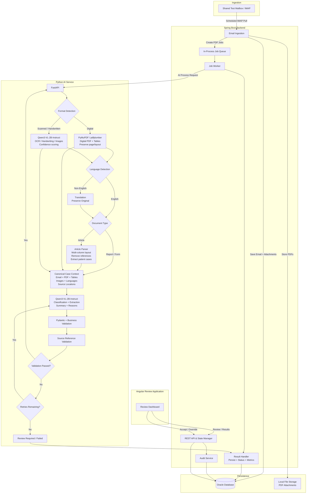

# Smart Inbox Assistant — High-Level Design (HLD)

## 1. Overview

The Smart Inbox Assistant is a healthcare/pharma document-understanding application that automates the first pass over a shared mailbox.

The system:

1. Reads incoming emails from a shared test mailbox.
2. Extracts sender, subject, date, body, and attachments.
3. Processes every PDF attachment.
4. Detects the PDF flavor and applies the appropriate extraction strategy.
5. Uses deterministic extraction where possible and a lightweight multimodal AI model where visual/semantic understanding is required.
6. Classifies each email/document into one or more categories:
   - ICSR / Safety Report
   - PQC / Quality Complaint
   - MI / Info Request
   - Not Relevant
7. Extracts domain-specific facts with confidence scores.
8. Links extracted facts back to the exact email or PDF page that produced them.
9. Generates a 10–15 sentence summary and relevance explanation.
10. Persists results and audit information in Oracle.
11. Presents the results to a human reviewer through an Angular UI.
12. Allows the reviewer to accept or override the AI output.

All test data is synthetic.

---

## 2. Goals

### Functional goals

- Mailbox ingestion
- PDF attachment processing
- Digital PDF extraction
- Scanned/handwritten PDF understanding
- Article PDF handling
- Non-English document handling
- Table extraction
- Meaningful image description and human-review flag
- Multi-label classification
- ICSR fact extraction
- PQC fact extraction
- MI fact extraction
- Summary generation
- Confidence scoring
- Source traceability
- Reviewer accept/override
- Audit logging
- Processing-time metrics

### Engineering goals

- Clear separation between frontend, backend, AI service, and persistence.
- Asynchronous document processing.
- Model-agnostic AI service boundary.
- Deterministic processing before AI inference where possible.
- Strong structured-output validation.
- Idempotent email/attachment processing.
- Easy local development and future production evolution.

---

## 3. Non-Goals

For the prototype:

- No real patient/client data.
- No automated final pharmacovigilance decision.
- No replacement of a human reviewer.
- No complex distributed messaging infrastructure.
- No production-scale Kubernetes deployment.
- No deep medical image diagnosis.
- No attempt to make the small multimodal model responsible for every PDF operation.

---

## 4. High-Level Architecture



### Architecture principle

The HLD deliberately separates deterministic document processing from AI reasoning.

For example:

- Digital PDF text is extracted with PyMuPDF.
- Tables are initially extracted with pdfplumber.
- Scanned/handwritten documents and meaningful images are handled by Qwen3-VL-2B-Instruct.
- The canonical context preserves page/source information before the model performs classification and semantic extraction.
- Pydantic/business validation runs after model inference.

This makes the smaller model practical while keeping the architecture replaceable.

---

## 5. Component Responsibilities

### 5.1 Angular Frontend

Responsibilities:

- Review queue
- Search/filter/sort
- Classification display
- Confidence display
- Summary display
- Extracted-facts table
- Editable AI results
- Email/document viewer
- Source-reference navigation
- Image descriptions
- Human-review flags
- Audit timeline
- Accept/override actions

The UI never calls the AI model directly.

---

### 5.2 Spring Boot Backend

Responsibilities:

- REST API
- Mailbox orchestration
- Email parsing
- Attachment persistence
- Job creation
- In-process queue
- AI service communication
- Result validation
- Result persistence
- State transitions
- Audit logging
- Metrics
- Reviewer actions

Spring Boot is the system-of-record orchestration layer.

---

### 5.3 Mailbox Ingestion

A `MailboxClient` abstraction is used so that the prototype can support both:

- a synthetic/mock mailbox for deterministic local testing
- a real test mailbox through IMAP

Flow:

```text
Mailbox
   ↓
MailboxClient
   ↓
EmailParser
   ↓
Email
   ↓
Attachments
   ↓
PDF Processing Jobs
```

Non-PDF attachments are logged but not processed.

---

### 5.4 In-Process Job Queue

AI/OCR processing can take several seconds to a minute, so mailbox ingestion should not block on AI processing.

Prototype approach:

```text
BlockingQueue<Long>
```

where the queue contains `jobId`.

Flow:

```text
EmailIngestionService
        ↓
ProcessingJob
        ↓
JobQueue
        ↓
JobWorker
        ↓
FastAPI
```

This can later be replaced by RabbitMQ, Kafka, SQS, or another queue without changing the higher-level service boundaries.

---

## 6. PDF Processing Architecture

### 6.1 Digital PDF

```text
PDF
 ↓
PyMuPDF
 ↓
Page-aware text extraction
 ↓
pdfplumber
 ↓
Table extraction
 ↓
Canonical Context
 ↓
Qwen3-VL-2B
```

Preserve:

- page number
- text block
- location/bounding information where available
- table rows/columns
- source references

---

### 6.2 Scanned / Handwritten PDF

```text
PDF
 ↓
Render page to image
 ↓
Qwen3-VL-2B-Instruct
 ↓
OCR / visual understanding
 ↓
Confidence
 ↓
Canonical Context
```

Handwriting uncertainty should result in lower confidence and/or human review.

---

### 6.3 Article PDF

```text
Article PDF
 ↓
Layout-aware extraction
 ↓
Multi-column handling
 ↓
Remove references/general discussion
 ↓
Identify patient-case content
 ↓
Qwen3-VL-2B
 ↓
Canonical Case Context
```

The system should focus on actual patient-case information rather than treating the entire article as a case.

---

### 6.4 Non-English PDF

```text
PDF
 ↓
Language Detection
 ↓
Original Text
 +
English Translation
 ↓
Canonical Context
 ↓
AI Analysis
```

The original language must be retained so that extracted facts remain traceable to the original source.

---

### 6.5 Tables

Tables should remain structured:

```text
Table
 ├── columns[]
 ├── rows[]
 └── pageNumber
```

They should not be flattened into ordinary text when structured extraction is possible.

---

### 6.6 Images

For meaningful images:

```text
Image
 ↓
Qwen3-VL-2B
 ↓
Short Description
 ↓
Confidence
 ↓
reviewRequired = true
```

Deep medical image diagnosis is outside the prototype scope.

---

## 7. Canonical Case Context

All document-processing paths converge into a common representation.

```text
CanonicalCaseContext
│
├── Email Metadata
├── Email Body
├── Documents
│   ├── Document Type
│   ├── Original Language
│   └── Pages
│
├── Text Blocks
│   ├── Text
│   ├── Location
│   ├── Confidence
│   └── Extraction Method
│
├── Tables
│   ├── Columns
│   ├── Rows
│   └── Page Number
│
├── Image Evidence
│   ├── Description
│   ├── Confidence
│   └── Review Required
│
└── Source Locations
```

This layer prevents the AI model from having to understand raw PDFs and source mapping at the same time.

---

## 8. AI Model Strategy

### Primary prototype model

**Qwen3-VL-2B-Instruct**

It is used as the lightweight multimodal model for:

- scanned documents
- handwriting
- meaningful images
- visual understanding
- classification
- semantic fact extraction
- summaries
- classification reasons

### Why a 2B model?

The prototype intentionally avoids requiring a large 7B+ model.

Instead:

```text
Deterministic extraction
        +
Targeted multimodal inference
        +
Strict schema validation
```

This reduces local hardware requirements and keeps inference focused on tasks where a vision-language model adds value.

### Model abstraction

The backend communicates through:

```text
AIClient
```

rather than hardcoding model details into Spring services.

The Python service also reads the model name/version from configuration.

This allows the prototype model to be replaced later with a larger self-hosted model or cloud model.

---

## 9. AI Pipeline

```text
START
  ↓
Format Detection
  ↓
Digital / Scanned Handling
  ↓
Language Detection
  ↓
Translation if required
  ↓
Document Type Detection
  ↓
Article Processing if required
  ↓
Canonicalization
  ↓
Qwen3-VL-2B Analysis
  ↓
Pydantic Validation
  ↓
Source Validation
  ↓
Valid?
 ├── Yes → Return Result
 └── No
       ↓
   Retry if allowed
       ↓
   Otherwise Review Required
```

---

## 10. Classification

The system supports multi-label classification.

Categories:

```text
ICSR
PQC
MI
NOT_RELEVANT
```

Each classification contains:

```text
category
confidence
reason
```

Example:

```json
{
  "category": "ICSR",
  "confidence": 0.94,
  "reason": "The message describes a specific patient, reporter, product and adverse reaction."
}
```

Multiple categories are allowed.

Example:

```text
ICSR = 0.96
PQC  = 0.84
```

---

## 11. Domain Extraction

### ICSR

```text
Patient
 ├── age
 ├── sex
 ├── weight
 ├── height
 └── relevant history

Reporter
 ├── identity
 ├── role
 └── country

Product
 ├── name
 ├── dose
 ├── route
 ├── start
 └── stop

Reaction
 ├── what happened
 ├── onset
 └── outcome

Seriousness

Narrative
```

### PQC

```text
Product
Batch / Lot
Issue
Photo Mentioned
```

### MI

```text
Questions[]
Product
Topic
```

---

## 12. Unknown / Not Stated Rule

The AI must never guess missing information.

If a field is not supported by the source:

```text
Not stated
```

Every extracted field must include:

```text
value
confidence
source reference
```

This is a core safety and traceability rule.

---

## 13. Source Traceability

Every extracted fact must point to exactly where it came from.

Supported source types:

```text
EMAIL
PDF
```

PDF source references include:

```text
attachmentId
pageNumber
textSnippet
location
```

Example:

```text
Field: Patient Age
Value: 54
Confidence: 0.91
Source: PDF page 2
Snippet: "Patient age: 54"
```

The Angular UI should allow the reviewer to click the source and navigate to the corresponding PDF page or email content.

---

## 14. AI Validation

Validation occurs in two stages.

### Schema validation

Pydantic validates:

- required response structure
- enum values
- numeric ranges
- confidence format
- nested structures

### Business validation

The service verifies:

- missing values are `Not stated`
- every extracted field has confidence
- every extracted field has a source
- source page numbers are valid
- classification has a reason
- summary exists
- multi-label classification is preserved
- no unsupported fields are returned

Invalid output is retried up to the configured maximum.

---

## 15. Oracle Persistence

Core logical model:

```text
EMAIL
 │
 ├── ATTACHMENT
 │      └── PROCESSING_JOB
 │             ├── PROCESSING_METRICS
 │             └── AI_RESULT
 │                    ├── CLASSIFICATION
 │                    ├── EXTRACTED_FIELD
 │                    │       └── SOURCE_REFERENCE
 │                    └── IMAGE_RESULT
 │
 └── AUDIT_LOG
```

### Main tables

#### EMAIL

```text
id
message_id
sender_email
subject
body
received_at
ingested_at
status
created_at
updated_at
```

#### ATTACHMENT

```text
id
email_id
filename
content_type
file_size
storage_reference
sha256_hash
is_pdf
status
created_at
```

#### PROCESSING_JOB

```text
id
attachment_id
status
retry_count
max_retries
queued_at
started_at
completed_at
error_code
error_message
created_at
updated_at
```

#### AI_RESULT

```text
id
job_id
email_id
model_name
model_version
prompt_version
summary
relevant
created_at
```

#### CLASSIFICATION

```text
id
ai_result_id
category
confidence
reason
created_at
```

#### EXTRACTED_FIELD

```text
id
ai_result_id
field_group
field_name
field_value
confidence
created_at
```

#### SOURCE_REFERENCE

```text
id
extracted_field_id
source_type
email_id
attachment_id
page_number
text_snippet
location
created_at
```

#### IMAGE_RESULT

```text
id
ai_result_id
attachment_id
page_number
description
confidence
review_required
created_at
```

#### PROCESSING_METRICS

```text
id
job_id
total_duration_ms
extraction_duration_ms
ocr_duration_ms
translation_duration_ms
llm_duration_ms
validation_duration_ms
created_at
```

#### AUDIT_LOG

```text
id
email_id
job_id
actor_type
actor_id
action
old_value
new_value
metadata
timestamp
```

---

## 16. State Management

### Email

```text
RECEIVED
   ↓
PROCESSING
   ↓
REVIEW_REQUIRED
   ↓
REVIEWED
```

Failure may transition to:

```text
FAILED
```

### Attachment

```text
RECEIVED
   ↓
QUEUED
   ↓
PROCESSING
   ↓
COMPLETED
```

Failure:

```text
FAILED
```

Unsupported:

```text
NOT_SUPPORTED
```

### Processing Job

```text
QUEUED
   ↓
PROCESSING
   ↓
COMPLETED
```

Retry:

```text
PROCESSING
   ↓
RETRYING
   ↓
PROCESSING
```

Terminal review path:

```text
PROCESSING
   ↓
REVIEW_REQUIRED
```

---

## 17. Idempotency

### Email

Use:

```text
message_id UNIQUE
```

to prevent duplicate mailbox processing.

### Attachment

Use:

```text
sha256_hash
```

to identify duplicate content.

### Job

Only one active processing job should exist for an attachment.

The worker must safely handle retries without creating ambiguous duplicate final results.

---

## 18. Transaction Boundaries

### Ingestion transaction

```text
Save Email
Save Attachments
Create Processing Jobs
```

Queueing should happen after the database transaction commits.

### AI result transaction

```text
Save AIResult
Save Classifications
Save Extracted Fields
Save Source References
Save Images
Save Metrics
Update Job
Update Email
```

### Reviewer transaction

```text
Update Result
Update Review Status
Write Audit Log
```

Reviewer changes and their audit record should succeed or fail together.

---

## 19. Error Handling

### Mailbox failure

Retry polling.

### Invalid email

Mark ingestion failure and log the error.

### Unsupported attachment

Log it as `NOT_SUPPORTED`; do not send it to the AI pipeline.

### PDF extraction failure

Retry/fallback to visual processing where appropriate.

### OCR/vision failure

Retry.

### LLM failure

Retry.

### Invalid AI response

Run validation and retry.

### Maximum retries reached

Move the job to:

```text
REVIEW_REQUIRED
```

or:

```text
FAILED
```

depending on the failure.

No document should be silently discarded.

---

## 20. API Boundary

### Review APIs

```text
GET  /api/review-items
GET  /api/review-items/{emailId}

POST /api/review-items/{emailId}/accept
POST /api/review-items/{emailId}/override
```

### Email APIs

```text
GET /api/emails/{emailId}
GET /api/emails/{emailId}/attachments
```

### Job APIs

```text
GET  /api/jobs/{jobId}
POST /api/jobs/{jobId}/retry
```

### AI service

```text
POST /ai/process
GET  /health
```

---

## 21. AI Request

```json
{
  "jobId": 101,
  "email": {
    "emailId": 10,
    "sender": "reporter@example.com",
    "subject": "Adverse event report",
    "body": "..."
  },
  "document": {
    "attachmentId": 25,
    "filename": "case-report.pdf",
    "contentType": "application/pdf",
    "storageReference": "/storage/25.pdf"
  }
}
```

---

## 22. AI Response

Conceptually:

```json
{
  "jobId": 101,
  "modelName": "Qwen3-VL-2B-Instruct",
  "modelVersion": "configured-version",
  "promptVersion": "v1",
  "summary": "10-15 sentence summary...",
  "relevant": true,
  "classifications": [
    {
      "category": "ICSR",
      "confidence": 0.94,
      "reason": "..."
    }
  ],
  "extractedFields": [
    {
      "fieldGroup": "patient",
      "fieldName": "age",
      "value": "54",
      "confidence": 0.91,
      "sourceReferences": [
        {
          "sourceType": "PDF",
          "attachmentId": 25,
          "pageNumber": 2,
          "textSnippet": "Patient age: 54",
          "location": "..."
        }
      ]
    }
  ],
  "imageResults": [
    {
      "pageNumber": 3,
      "description": "Damaged outer packaging is visible.",
      "confidence": 0.82,
      "reviewRequired": true
    }
  ]
}
```

---

## 23. Angular Review Flow

```text
Review Queue
      ↓
Select Item
      ↓
Review Detail
      ├── Email
      ├── PDF
      ├── Classification
      ├── Summary
      ├── Extracted Facts
      ├── Source References
      ├── Images
      └── Audit Timeline
      ↓
Accept / Override
```

### Queue

Display:

```text
Sender
Subject
Date
Classification
Confidence
Summary
Status
```

### Detail

Display:

- email body
- PDF viewer
- classification/reasons
- confidence
- extracted facts
- source references
- image descriptions
- review flags
- audit timeline

---

## 24. Review Actions

### Accept

```text
AI Result
   ↓
Reviewer Accept
   ↓
Audit Log
   ↓
REVIEWED
```

### Override

```text
AI Result
   ↓
Reviewer edits
   ↓
Save new value
   ↓
Audit Log
   ↓
REVIEWED
```

Audit records should contain:

```text
actor
timestamp
action
old value
new value
```

---

## 25. Security and Data Handling

Prototype principles:

- Synthetic data only.
- No real patient/client data.
- Credentials stored through environment variables.
- Never commit API keys/passwords.
- Restrict reviewer endpoints appropriately.
- Validate all incoming requests.
- Avoid logging sensitive document contents unnecessarily.
- Keep model/prompt versions with AI results.

If a cloud AI API is used later, the write-up should explicitly document the data-handling trade-off.

---

## 26. Observability and Metrics

For each processing job record:

```text
total duration
extraction duration
OCR duration
translation duration
LLM duration
validation duration
```

Also record:

```text
job status
retry count
failure reason
model version
prompt version
```

The final test should process at least 10–15 documents and report per-document processing time.

---

## 27. Suggested Project Structure

```text
clinevo-smart-inbox/
│
├── backend/
│   └── src/main/java/com/clinevo/inbox/
│       ├── controller/
│       ├── service/
│       ├── ingestion/
│       ├── queue/
│       ├── client/
│       ├── validation/
│       ├── entity/
│       ├── repository/
│       ├── dto/
│       ├── mapper/
│       └── exception/
│
├── ai-service/
│   ├── app/
│   │   ├── main.py
│   │   ├── api/
│   │   ├── graph/
│   │   │   ├── pipeline.py
│   │   │   ├── state.py
│   │   │   └── nodes/
│   │   ├── schemas/
│   │   ├── extraction/
│   │   ├── prompts/
│   │   └── models/
│   └── tests/
│
├── frontend/
│   └── src/app/
│       ├── review-queue/
│       ├── review-detail/
│       ├── classification/
│       ├── extracted-facts/
│       ├── source-viewer/
│       ├── pdf-viewer/
│       └── audit-timeline/
│
├── database/
│   └── schema.sql
│
├── test-data/
│   ├── emails/
│   └── pdfs/
│
└── docs/
    ├── hld.md
    ├── lld.md
    └── sample-output.json
```

---

## 28. Testing Strategy

### Unit tests

Test:

- email parsing
- attachment detection
- duplicate detection
- PDF format detection
- classification validation
- confidence validation
- `Not stated` rules
- source-reference validation
- state transitions

### Integration tests

Test:

```text
Mailbox
 → Spring
 → Oracle
 → Queue
 → FastAPI
 → Oracle
```

### End-to-end tests

At minimum cover:

1. Detailed ICSR
2. Minimal ICSR
3. ICSR + PQC
4. PQC-only
5. MI-only
6. Not Relevant
7. Digital PDF
8. Scanned PDF
9. Handwritten PDF
10. Article PDF
11. Non-English PDF
12. Table-containing PDF
13. Image-containing PDF
14. Invalid/failed PDF
15. Duplicate email

---

## 29. Test Dataset

Use only synthetic data.

Target dataset:

- At least 10 sample emails.
- At least 5 digital PDFs.
- At least 2 scanned/handwritten PDFs.
- At least 5 article PDFs.
- At least 2 non-English PDFs.
- At least 2 PQC-only examples.
- At least 2 MI-only examples.
- At least 1 irrelevant example.

---

## 30. Optional Literature Screening Extension

Only after the core application is working:

```text
Independent Article Upload
        ↓
Article Processing
        ↓
Patient Case Detection
        ↓
Multiple Case Splitting
        ↓
Summary + Relevance
        ↓
Reuse Review UI
```

The extension should identify whether an article describes a real identifiable patient case worth reporting and split multiple cases when present.

---

## 31. Prototype Implementation Order

### Phase 1 — Foundation

```text
Spring Boot
 ↓
Oracle
 ↓
Entities + repositories
 ↓
Mailbox client
 ↓
Email parser
 ↓
Attachment storage
 ↓
Processing jobs
 ↓
In-process queue
```

### Phase 2 — AI Pipeline

```text
FastAPI
 ↓
PyMuPDF
 ↓
pdfplumber
 ↓
Qwen3-VL-2B
 ↓
Canonical context
 ↓
Classification
 ↓
Fact extraction
 ↓
Summary
 ↓
Pydantic validation
 ↓
Source validation
 ↓
Spring persistence
```

### Phase 3 — Reviewer Application

```text
Angular
 ↓
Review queue
 ↓
Review detail
 ↓
PDF/email viewer
 ↓
Source navigation
 ↓
Accept / Override
 ↓
Audit timeline
```

### Phase 4 — Hardening

```text
Retry
Idempotency
Metrics
Failure handling
10–15 document benchmark
Screenshots
Sample JSON
README
Write-up
Demo
```

---

## 32. Production Evolution

The prototype can evolve toward:

```text
IMAP / Microsoft Graph
        ↓
Enterprise Message Queue
        ↓
Spring Boot Services
        ↓
Object Storage
        ↓
Dedicated AI Processing Workers
        ↓
Model Gateway
        ↓
Oracle
        ↓
Angular
```

Potential production improvements:

- durable message broker
- object storage
- horizontally scalable AI workers
- model gateway
- OCR service
- authentication/authorization
- secrets manager
- distributed tracing
- centralized logging
- monitoring/alerts
- dead-letter queues
- stronger document-version management
- human-review analytics

The prototype intentionally avoids these components to keep implementation focused and demonstrable.

---

## 33. Key Design Decisions for the Walkthrough

### Why Spring Boot + Python?

Spring Boot handles enterprise API/orchestration/persistence while Python provides the document/AI ecosystem.

### Why asynchronous processing?

OCR and multimodal inference can take seconds, so mailbox ingestion should not wait for AI processing.

### Why Qwen3-VL-2B?

It provides a lightweight multimodal model for local prototype inference. The architecture does not depend on the model size and can be upgraded later.

### Why deterministic PDF extraction?

Text and tables that can be extracted reliably do not need expensive model inference. The model is reserved for visual and semantic understanding.

### Why canonical context?

It gives the AI model a consistent representation regardless of the PDF flavor and preserves source information for traceability.

### Why Pydantic validation?

LLM output is probabilistic; application state should not be. Structured validation creates a reliable boundary between AI output and business persistence.

### Why source references?

Healthcare/pharma review requires the human reviewer to verify where an extracted fact came from.

### Why audit logging?

Every AI decision and reviewer change must be traceable.

---

## 34. Demo Narrative

The 15–20 minute walkthrough should follow one representative email:

```text
1. Show the incoming synthetic email.
2. Show the PDF attachment.
3. Show the processing job.
4. Show the AI classification.
5. Show confidence + reason.
6. Show extracted ICSR/PQC/MI facts.
7. Click a fact's source.
8. Navigate to the PDF page.
9. Show image/table handling if applicable.
10. Show summary.
11. Accept or override a result.
12. Show the audit timeline.
13. Show Oracle persistence/metrics.
14. Show batch-processing timing.
15. Briefly explain architecture and model trade-offs.
```

The goal is to demonstrate the complete path:

```text
Email
  ↓
Ingestion
  ↓
Queue
  ↓
PDF Understanding
  ↓
AI Classification
  ↓
Fact Extraction
  ↓
Source Traceability
  ↓
Human Review
  ↓
Audit
  ↓
Oracle
```

---

## 35. Deliverables Checklist

- [ ] Working frontend
- [ ] Working Spring Boot backend
- [ ] Working Oracle persistence
- [ ] Working Python AI service
- [ ] Working mailbox/test ingestion
- [ ] Digital PDF processing
- [ ] Scanned/handwritten processing
- [ ] Article processing
- [ ] Non-English processing
- [ ] Table extraction
- [ ] Image description + review flag
- [ ] Multi-label classification
- [ ] ICSR extraction
- [ ] PQC extraction
- [ ] MI extraction
- [ ] Source references
- [ ] Confidence scores
- [ ] `Not stated` handling
- [ ] Audit logging
- [ ] Accept/override
- [ ] 10–15 document batch benchmark
- [ ] Sample JSON
- [ ] Screenshots/video
- [ ] README
- [ ] 2–5 page write-up
- [ ] Optional literature screening if time permits
