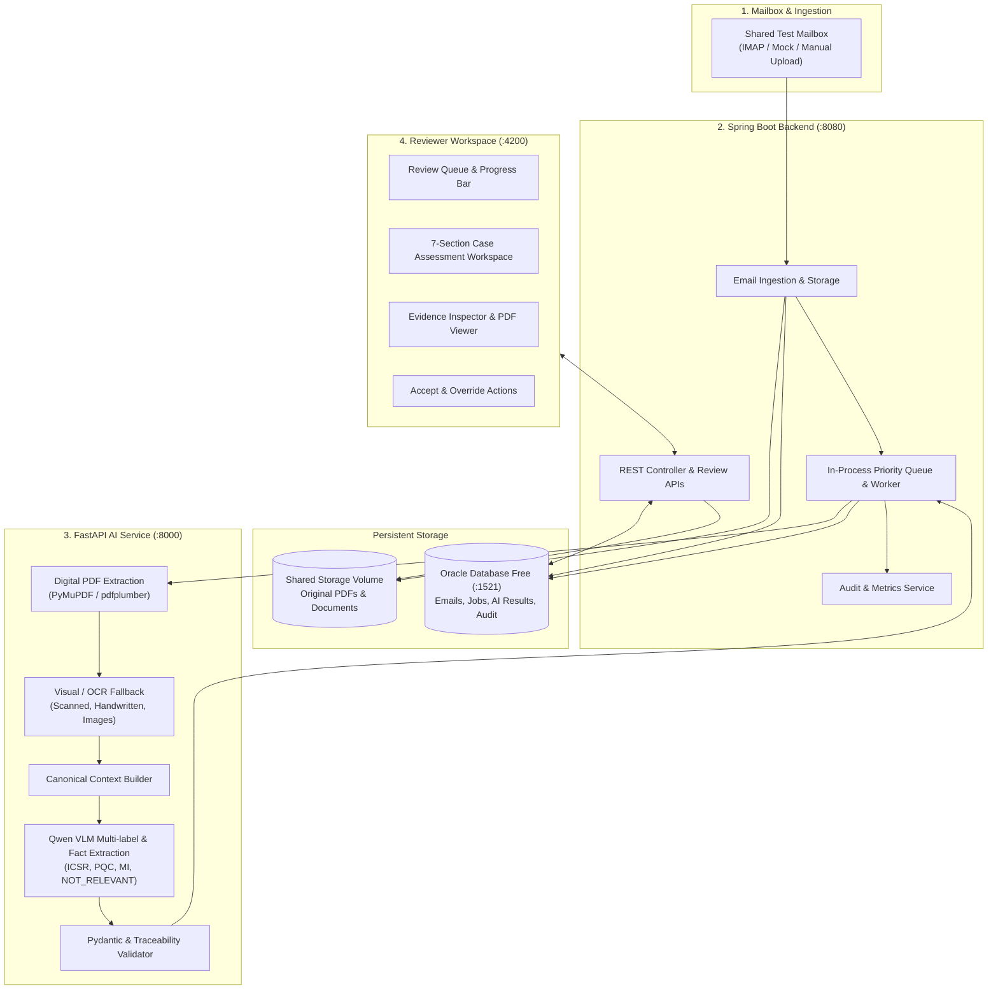

# Smart Inbox Assistant — High-Level Design (HLD)

## 1. Executive Summary

The **Smart Inbox Assistant** is an enterprise healthcare and pharmacovigilance application that automates the ingestion, classification, fact extraction, and source traceability of incoming medical emails and PDF reports. 

Designed strictly as an advisory human-in-the-loop system, it performs first-pass document understanding and presents structured case assessments to human reviewers through an intuitive workspace.

---

## 2. System Architecture



---

## 3. Core Component Responsibilities

| Tier | Technology | Key Responsibilities |
| :--- | :--- | :--- |
| **Frontend** | Vanilla JS / CSS / Nginx (`:4200`) | Review queue with real-time status polling, 7-section case assessment hierarchy, inline PDF page navigation, evidence inspector, and accept/override review workflows. |
| **Backend** | Spring Boot 3.2 / Java 21 (`:8080`) | IMAP mailbox polling & synthetic upload handling, in-process job queue, AI orchestration, Oracle persistence, idempotency checking, and audit logging. |
| **AI Service** | FastAPI / Python 3.11 (`:8000`) | Deterministic PDF text/table extraction (PyMuPDF), scanned OCR fallback, canonical context assembly, Qwen VLM multi-label classification, domain extraction, and strict validation. |
| **Database** | Oracle Database Free 23c (`:1521`) | Relational persistence for emails, attachments, jobs, classifications, extracted facts, source coordinates, processing metrics, and audit history. |
| **Storage** | Docker Named Volume (`storage`) | Durable local document storage preserving original binary PDF attachments and synthetic email bodies. |

---

## 4. Current Project Structure

```text
smart-inbox/
├── frontend/                     # Nginx + Reviewer UI
│   ├── src/                      # HTML, CSS design system, application logic
│   ├── nginx.conf                # Reverse proxy configuration (/api & /health)
│   └── Dockerfile                # Alpine-based Nginx container
├── backend/                      # Spring Boot Application
│   ├── src/main/java/            # Controllers, Services, Entities, Ingestion, Queue
│   ├── src/main/resources/       # application.yml configuration
│   ├── pom.xml                   # Maven dependencies & build definitions
│   └── Dockerfile                # Multi-stage JDK 21 container
├── ai-service/                   # FastAPI Document Understanding Microservice
│   ├── app/                      # Pipeline, Graph nodes, Schemas, Prompts
│   ├── tests/                    # Pipeline validation & unit tests
│   ├── requirements.txt          # Python dependencies (FastAPI, PyMuPDF, Pydantic)
│   └── Dockerfile                # Python 3.11 microservice container
├── database/                     # Oracle Database Assets
│   ├── schema.sql                # DDL for 10 relational entities & indexes
│   └── seed.sql                  # Initial synthetic seed data
├── storage/                      # Persistent storage mount for PDF files
├── test-data/                    # Synthetic test suite
│   ├── emails/                   # Raw synthetic email samples
│   ├── pdfs/                     # Clinical PDFs (digital, scanned, complaints)
│   └── generate_test_data.py     # Deterministic test dataset generator
├── docker-compose.yml            # Multi-container orchestration (4 services + volumes)
├── .env.example / .env           # Environment & database credentials
├── README.md                     # Quickstart and operations guide
├── hld.md                        # High-Level Architecture (this document)
├── lld.md                        # Low-Level System Design & Data Models
├── implementation-strategy.md    # Engineering implementation milestones
└── AGENTS.md                     # Safety rules, non-negotiable standards, & contract
```

---

## 5. Non-Negotiable Safety & Design Principles

1. **Synthetic Data Only**: Real patient or client identifiers are never ingested or stored.
2. **Never Guess ("Not stated")**: If an attribute (e.g., patient age, product batch, reaction date) is absent or unsupported by the source text, it is strictly recorded as `"Not stated"`. Hallucination is barred.
3. **Mandatory Source Traceability**: Every extracted fact links back to its origin:
   - For PDFs: Attachment ID, page number, and verbatim text snippet.
   - For Emails: Email ID and exact body text snippet.
4. **Multi-Label Classification**: Each document is classified across `ICSR`, `PQC`, `MI`, and `NOT_RELEVANT` with bounded confidence scores (0.0 to 1.0) and explicit justification.
5. **Human-in-the-Loop Oversight**: AI is strictly advisory. Final disposition requires reviewer acceptance or explicit override, both recorded in an immutable audit trail.

---

## 6. Case Assessment UI Hierarchy

The Reviewer Workspace displays cases using a scannable 7-section clinical hierarchy:
1. **AI Assessment & Review Status**: Side-by-side hero cards displaying primary classification, confidence, and reviewer guidance (`⚠ HUMAN REVIEW REQUIRED` or `✓ APPROVED`).
2. **Case Snapshot**: Key metadata grid (Source file, Sender, Subject, Document type, Language, Received date).
3. **Why This Classification?**: Structured justification for triggered categories.
4. **Classification Signals Matrix**: Multi-label status table across ICSR, PQC, MI, and NOT_RELEVANT.
5. **Domain-Specific Findings**: Dynamically adapts by category:
   - *ICSR*: Patient, Reporter, Product, and Adverse Reaction groupings.
   - *PQC*: Product, Batch / Lot, Quality Issue, and Supporting Evidence.
   - *MI*: Prominent Inquiry Question callout, Product, and Topic.
   - *NOT_RELEVANT*: Clean notice confirming no clinical facts identified, with *Not applicable* indicators (no empty ICSR forms).
6. **Data Quality & Traceability**: Quality checklist with live counts of extracted fields, verified evidence links, and `"Not stated"` fields.
7. **Detailed AI Narrative**: Collapsible accordion providing the full 10–15 sentence clinical narrative summary.

---

## 7. Deployment & Operations

The entire stack is containerized and managed via Docker Compose on a unified internal bridge network (`smart-inbox-network`):

```bash
# Build and start all services
docker compose up --build -d

# Verify system health
docker compose ps
```

- **Frontend**: Accessible at `http://localhost:4200`
- **Backend API**: Accessible at `http://localhost:8080` (`/actuator/health`)
- **AI Service**: Accessible at `http://localhost:8000` (`/health`)
- **Oracle Database**: Listening on `localhost:1521`
