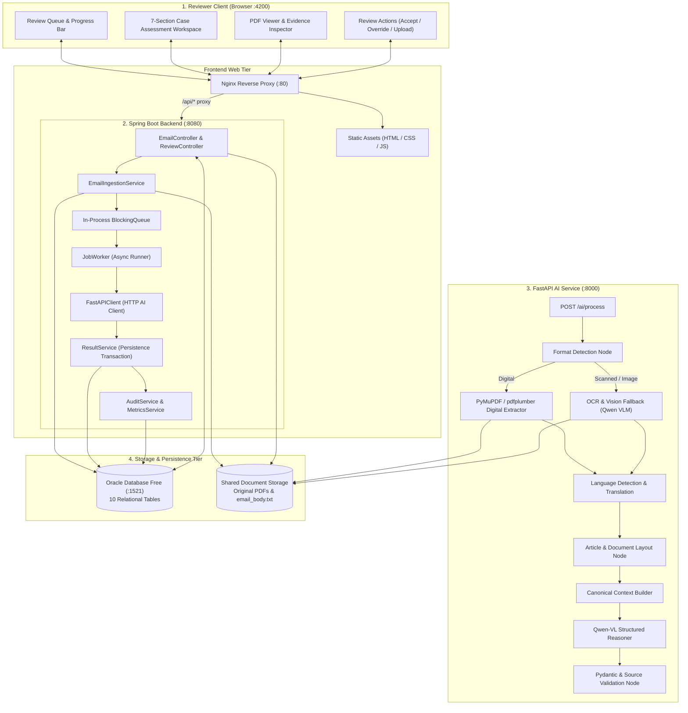

# Smart Inbox Assistant — Low-Level Design (LLD)

## 1. System Overview

The **Smart Inbox Assistant** is an advisory document intelligence system for healthcare, safety, and quality review teams. It ingests clinical emails and PDF attachments, classifies them across multi-label categories (`ICSR`, `PQC`, `MI`, `NOT_RELEVANT`), extracts domain facts with 100% source traceability, and presents structured case assessments to human reviewers through an interactive review workspace.

---

## 2. Complete Architecture & Data Flow



---

## 3. Repository & Package Layout

```text
smart-inbox/
├── frontend/                     # Nginx + Reviewer Workspace UI
│   ├── src/
│   │   ├── index.html            # Single Page Application & 7-section hierarchy
│   │   ├── styles.css            # Monochromatic design system tokens & layouts
│   │   └── app.js                # State management, API calls, dynamic rendering
│   ├── nginx.conf                # Nginx proxy configuration for /api and /health
│   └── Dockerfile                # Alpine Nginx container
├── backend/                      # Spring Boot 3.2 (Java 21)
│   ├── src/main/java/com/clinevo/inbox/
│   │   ├── controller/           # EmailController, ReviewController, JobController
│   │   ├── service/              # EmailService, ReviewService, ResultService, AuditService
│   │   ├── ingestion/            # EmailIngestionService, EmailParser
│   │   ├── queue/                # JobQueue (BlockingQueue), JobWorker
│   │   ├── client/               # AIClient interface & FastAPIClient implementation
│   │   ├── entity/               # JPA Entities (Email, ProcessingJob, AIResult, etc.)
│   │   ├── repository/           # Spring Data JPA Repositories
│   │   ├── dto/                  # Request/Response DTOs & ReviewDetailDto
│   │   └── exception/            # GlobalExceptionHandler & domain exceptions
│   ├── src/main/resources/       # application.yml
│   └── Dockerfile                # Multi-stage JDK 21 build
├── ai-service/                   # Python FastAPI Document Intelligence Microservice
│   ├── app/
│   │   ├── main.py               # FastAPI entrypoint, /ai/process & /health
│   │   ├── graph/                # Pipeline orchestrator & pipeline state
│   │   │   ├── pipeline.py       # Linear/graph extraction node sequence
│   │   │   └── nodes/            # Extraction, OCR, Language, Canon, VLM, Validation
│   │   ├── schemas/              # Pydantic models (Canonical, Domain, Request, Response)
│   │   └── prompts/              # System prompts & master extraction instructions
│   ├── tests/                    # Pipeline integration tests
│   └── Dockerfile                # Python 3.11 microservice container
├── database/                     # Oracle schema & initial seed scripts
├── storage/                      # Persistent storage mount for attachments
├── test-data/                    # Synthetic test emails & PDFs
├── docker-compose.yml            # Multi-container orchestration
├── .env.example                  # Environment configuration template
└── AGENTS.md                     # Safety & engineering contract
```

---

## 4. Oracle Relational Data Model

The application models the domain through 10 interrelated Oracle entities with referential integrity and indexes:

```text
EMAIL
 ├── ATTACHMENT
 │      └── PROCESSING_JOB
 │              ├── PROCESSING_METRICS
 │              └── AI_RESULT
 │                     ├── CLASSIFICATION
 │                     ├── EXTRACTED_FIELD
 │                     │      └── SOURCE_REFERENCE
 │                     └── IMAGE_RESULT
 └── AUDIT_LOG
```

### Table Definitions

| Table Name | Primary Key | Key Foreign Keys | Purpose |
| :--- | :--- | :--- | :--- |
| `EMAILS` | `id` | — | Ingested email metadata, sender, subject, body, status (`RECEIVED`, `PROCESSING`, `REVIEW_REQUIRED`, `REVIEWED`, `FAILED`). Unique on `message_id`. |
| `ATTACHMENTS` | `id` | `email_id` &rarr; `EMAILS(id)` | Attachment filename, SHA-256 hash, storage path, file size, PDF flag. |
| `PROCESSING_JOBS` | `id` | `attachment_id` &rarr; `ATTACHMENTS(id)` | Job lifecycle status (`QUEUED`, `PROCESSING`, `COMPLETED`, `RETRYING`, `REVIEW_REQUIRED`, `FAILED`), retry count, error message. |
| `AI_RESULTS` | `id` | `job_id` &rarr; `PROCESSING_JOBS(id)` | Model name, model version, execution timestamp, structured clinical summary narrative. |
| `CLASSIFICATIONS` | `id` | `ai_result_id` &rarr; `AI_RESULTS(id)` | Multi-label category (`ICSR`, `PQC`, `MI`, `NOT_RELEVANT`), confidence score (0.00–1.00), justification reason. |
| `EXTRACTED_FIELDS` | `id` | `ai_result_id` &rarr; `AI_RESULTS(id)` | Domain field group (`patient`, `product`, `reaction`, `reporter`, `pqc`, `mi`), field name, extracted value (`"Not stated"` if absent), confidence. |
| `SOURCE_REFERENCES`| `id` | `extracted_field_id` &rarr; `EXTRACTED_FIELDS(id)` | Source type (`PDF` or `EMAIL`), page number, bounding box coordinates, verbatim text snippet. |
| `IMAGE_RESULTS` | `id` | `ai_result_id` &rarr; `AI_RESULTS(id)` | Extracted image reference, page number, AI descriptive caption, confidence. |
| `PROCESSING_METRICS`| `id` | `job_id` &rarr; `PROCESSING_JOBS(id)` | Breakdown durations in milliseconds: extraction, OCR, translation, LLM inference, validation, and total time. |
| `AUDIT_LOGS` | `id` | `email_id` &rarr; `EMAILS(id)` | Immutable action log (`EMAIL_INGESTED`, `AI_COMPLETED`, `REVIEW_ACCEPTED`, `REVIEW_OVERRIDE`), actor ID, actor type, old value, new value, timestamp. |

---

## 5. Ingestion, Queue & Worker Design

### 5.1 Attachment Fallback Handling
Every incoming email requires automated analysis. When an email arrives without PDF attachments:
- `EmailIngestionService` creates a synthetic attachment named `email_body.txt`.
- Saves the body content to the storage repository.
- Creates an attachment record and enqueues a `ProcessingJob`.
- Guarantees 100% processing across both email bodies and file attachments.

### 5.2 In-Process Queue & Asynchronous Worker
- **Queue Implementation**: `java.util.concurrent.BlockingQueue<Long>` (`JobQueue`) holds pending `jobId`s.
- **Worker Execution**: `JobWorker` runs a continuous background loop:
  1. Retrieves next `jobId` from queue.
  2. Updates `ProcessingJob` state to `PROCESSING`.
  3. Prepares `AIProcessRequestDto` containing document storage path and email text.
  4. Calls `FastAPIClient.process(request)`.
  5. On success: executes `ResultService.saveAIResult()` in an isolated database transaction, moving job to `COMPLETED` and email to `REVIEW_REQUIRED`.
  6. On failure: logs audit entry, triggers retry up to `maxRetries` (default 3), or escalates to `REVIEW_REQUIRED` / `FAILED`.

---

## 6. Document Intelligence Pipeline (AI Microservice)

The FastAPI microservice processes documents using deterministic tools first, reserving the vision-language model for multimodal and semantic extraction:

```text
[Input Document: PDF / TXT]
       │
       ▼
1. Format Detection ────► (Digital PDF, Scanned PDF, or Plain Text)
       │
       ├─► Digital: PyMuPDF extracts text coordinates, pages, layout; pdfplumber extracts tables.
       └─► Scanned / Image: Page rendered to image -> Qwen Vision OCR -> text blocks + confidence.
       │
       ▼
2. Language Detection & Translation ──► Detects language (e.g. French, German). Preserves original text
                                         and adds English translation alongside source page coordinates.
       │
       ▼
3. Article & Layout Analysis ────────► Filters bibliography/reference sections, handles multi-column layouts,
                                         and isolates clinical case narratives from background discussion.
       │
       ▼
4. Canonical Context Assembly ───────► Normalizes document into CanonicalCaseContext:
                                         { email, documents, pages, tables, images, textBlocks }
       │
       ▼
5. Qwen-VL Structured Reasoner ──────► Ingests canonical context + master extraction prompt.
                                         Outputs multi-label classification, reasons, structured facts,
                                         source coordinates, and 10–15 sentence clinical summary.
       │
       ▼
6. Pydantic & Source Quality Gates ──► Validates:
                                         - Missing clinical facts strictly equal "Not stated".
                                         - Every extracted field contains valid source references.
                                         - Category confidences are bounded [0.0, 1.0].
                                         - Page numbers exist in the source document.
```

---

## 7. Reviewer Workspace Design (Frontend Tier)

### 7.1 Real-Time Queue & Progress Polling
- Displays queue status chips (`X in queue`) with pulsing indicators when documents are processing.
- Automatically polls `/api/review-items` every 2.5 seconds while active jobs exist.
- Shows dynamic case progress bar (15% Queued &rarr; 65% Processing &rarr; 100% Complete).

### 7.2 The 7-Section Case Assessment Hierarchy
The case view organizes critical review data into a scannable, standardized clinical workspace:

1. **Section 1: AI Assessment & Review Status**
   - **Card A (AI Assessment)**: Primary category label (e.g., `PATIENT SAFETY`), category code (`ICSR`), confidence pill (`95% confidence`), and lead clinical reason.
   - **Card B (Review Status)**: Prominent status badge (`⚠ HUMAN REVIEW REQUIRED` or `✓ APPROVED BY REVIEWER`) with operational instructions for review sign-off.
2. **Section 2: Case Snapshot**
   - Clean metadata grid: Source file, Sender, Subject, Document type, Language, and Received date.
3. **Section 3: Why This Classification?**
   - Structured list of backend reasoning for all triggered classification categories.
4. **Section 4: Classification Signals Matrix**
   - Multi-label matrix comparing all 4 standard categories (`Patient Safety (ICSR)`, `Product Quality (PQC)`, `Medical Inquiry (MI)`, and `Not Relevant`) with confidence percentages and `● Detected` vs `○ Not detected` status.
5. **Section 5: Domain-Specific Findings (Dynamic Adaptation)**
   - **ICSR**: Displays `Patient` (Age, Sex, Weight, Height, History), `Reporter` (Identity, Role, Country), `Product` (Name, Dose, Route, Dates), and `Reaction` (Description, Onset, Outcome, Seriousness, Narrative).
   - **PQC**: Displays `Product & Batch` (Product, Batch / Lot), `Quality Issue` (Complaint, Severity), and `Supporting Evidence` (Photo mentioned, Image evidence).
   - **MI**: Displays prominent `Inquiry Question(s)` callout box, `Product`, `Topic`, and `Context`.
   - **NOT_RELEVANT**: Cleanly shows `"No domain-specific case information was identified."` with *Not applicable* indicators. **Zero empty ICSR patient forms rendered.**
   - **Source Navigation**: Clicking any finding's source button (`Page 1`, `Email`) triggers `inspectSourceByFieldId`, opening the Evidence Inspector and navigating the embedded PDF viewer to that exact page.
6. **Section 6: Data Quality & Traceability**
   - Verification checklist with live calculated counters from active case fields:
     - `Total Extracted Fields`
     - `Evidence Linked`
     - `Marked "Not stated"`
7. **Section 7: Detailed AI Narrative**
   - Collapsible accordion (`[View full narrative ↓]`) revealing the full 10–15 sentence AI-generated clinical narrative summary.

---

## 8. REST API Specifications

### Review Endpoints

| Method | Endpoint | Description |
| :--- | :--- | :--- |
| `GET` | `/api/review-items` | Retrieves list of inbox items. Supports query parameters `category` (`ALL`, `ICSR`, `PQC`, `MI`, `NOT_RELEVANT`, `QUEUED`) and `search`. |
| `GET` | `/api/review-items/{emailId}` | Retrieves full case detail (`ReviewDetailDto`), including attachments, AI classifications, extracted facts, source coordinates, audit history, and job status. |
| `POST` | `/api/review-items/{emailId}/accept` | Submits reviewer approval (`ReviewAcceptRequest`), updates email status to `REVIEWED`, and writes an immutable audit record. |
| `POST` | `/api/review-items/{emailId}/override`| Submits reviewer overrides (`ReviewOverrideRequest`), updating classifications and field values while preserving original values in the audit log. |

### Ingestion & Document Endpoints

| Method | Endpoint | Description |
| :--- | :--- | :--- |
| `POST` | `/api/emails/upload` | Multipart upload for manual test ingestion (`sender`, `subject`, `body`, and optional file `file`). Enqueues processing job immediately. |
| `POST` | `/api/emails/poll` | Triggers manual check of configured IMAP/Mock mailbox. |
| `GET` | `/api/emails/{emailId}/attachments/{attachmentId}/content` | Streams raw attachment binary (PDF, text) for inline browser rendering and download. |

### Job & AI Endpoints

| Method | Endpoint | Description |
| :--- | :--- | :--- |
| `GET` | `/api/jobs/{jobId}` | Returns processing status and metrics for a specific background job. |
| `POST` | `/api/jobs/{jobId}/retry` | Re-enqueues a failed or review-required job. |
| `POST` | `/ai/process` | Internal FastAPI endpoint processing document content into validated structured JSON. |
| `GET` | `/health` | Healthcheck endpoint for AI service and Frontend proxy. |

---

## 9. Error Handling & Resilience Strategy

| Failure Scenario | Component | Resolution Strategy |
| :--- | :--- | :--- |
| **Mailbox Connection Dropped** | Spring Boot Ingestion | Logged; polling automatically retries on subsequent schedule without dropping queued work. |
| **Transient AI Timeout / Failure** | `JobWorker` | Job is re-enqueued with incremented `retryCount`. If `retryCount >= maxRetries`, status becomes `REVIEW_REQUIRED`. |
| **Malformed / Invalid Model JSON** | AI Service & Pydantic | Pydantic validator rejects malformed responses; pipeline triggers targeted correction prompt. |
| **Corrupted / Empty PDF** | Digital Extraction Node | Catches extraction exceptions, flags document as unreadable, and marks job as `REVIEW_REQUIRED` with clear diagnostic logs. |
| **Reviewer Override Conflict** | Result Service | Transactions are executed with optimistic locking; overrides record both previous and new values in the audit trail. |
