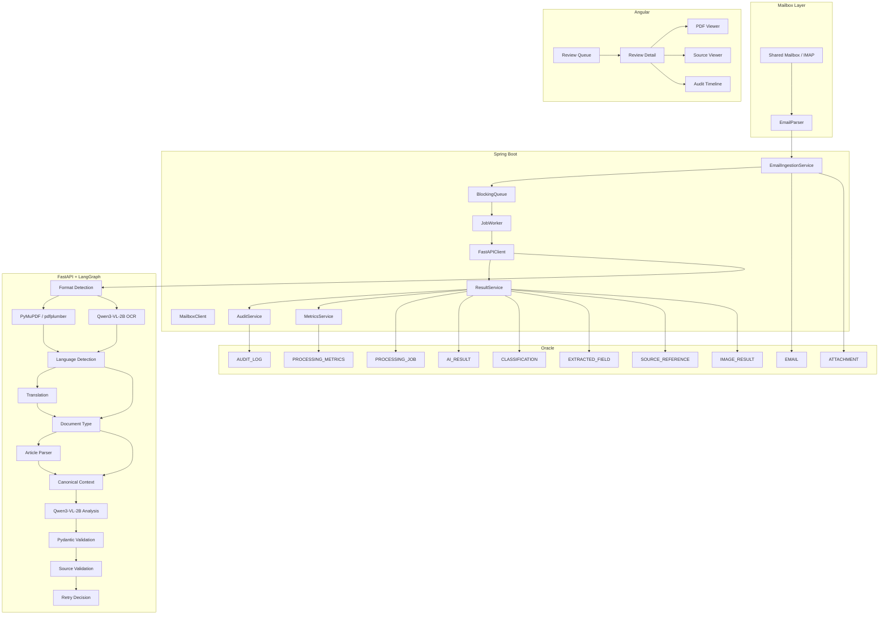

# Smart Inbox Assistant — Low-Level Design (LLD)

## 1. Purpose

This LLD translates the HLD into an implementation-ready design for a working prototype using:

- Angular (Frontend)
- Spring Boot (Backend)
- Python FastAPI + LangGraph (AI Service)
- Oracle Database
- Qwen3-VL-2B-Instruct
- PyMuPDF + pdfplumber
- In-process job queue

The design prioritizes a working prototype with clear service boundaries, deterministic document extraction, traceable AI outputs, and auditability.

---

# 2. Repository Structure

```text
clinevo-smart-inbox/
│
├── backend/
├── ai-service/
├── frontend/
├── database/
├── test-data/
└── docs/
```

---

# 3. Spring Boot Package Structure

```text
backend/src/main/java/com/clinevo/inbox/
├── controller/
├── service/
├── ingestion/
├── queue/
├── client/
├── validation/
├── entity/
├── repository/
├── dto/
├── mapper/
└── exception/
```

---

# 4. Backend Components

| Component | Responsibility |
|-----------|---------------|
| MailboxClient | Read mailbox |
| EmailParser | Parse email |
| EmailIngestionService | Save email & jobs |
| JobQueue | Queue jobs |
| JobWorker | Execute jobs |
| FastAPIClient | Call AI |
| ResultService | Persist AI result |
| AuditService | Audit logging |
| MetricsService | Processing metrics |

---

# 5. Mailbox Layer

## Interface

```java
public interface MailboxClient {
    List<RawEmail> fetchNewMessages();
    void markProcessed(String messageId);
}
```

Implementations:

- MockMailboxClient
- ImapMailboxClient

---

# 6. Email Ingestion Flow

```text
Mailbox
 ↓
MailboxClient
 ↓
EmailParser
 ↓
Duplicate Check
 ↓
Save Email
 ↓
Save Attachments
 ↓
Create PDF Jobs
 ↓
Job Queue
```

Duplicate detection uses:

- `message_id`
- attachment SHA-256

---

# 7. Queue Design

Implementation:

```java
BlockingQueue<Long>
```

The queue stores `jobId`.

Flow:

```text
JobQueue
 ↓
JobWorker
 ↓
FastAPI
```

---

# 8. Job Worker

Pseudo flow:

```java
while(true){

  jobId = queue.take();

  PROCESSING

  call AI

  success → COMPLETED

  failure → RETRY / REVIEW_REQUIRED
}
```

---

# 9. FastAPI Structure

```text
ai-service/app/
├── api/
├── graph/
│   ├── pipeline.py
│   ├── state.py
│   └── nodes/
├── extraction/
├── schemas/
├── prompts/
└── models/
```

---

# 10. LangGraph Pipeline

```text
START
 ↓
Format Detection
 ↓
Digital OR Scanned
 ↓
Language Detection
 ↓
Translation
 ↓
Document Type
 ↓
Article Processing
 ↓
Canonical Context
 ↓
Qwen3-VL-2B
 ↓
Validation
 ↓
Retry
 ↓
Response
```

---

# 11. GraphState

```python
class GraphState:
    job_id: int
    attachment_id: int
    document_format: str
    language: str
    document_type: str
    canonical_context: dict
    ai_result: dict
    retry_count: int
```

---

# 12. Format Detection Node

Returns:

- DIGITAL
- SCANNED

Decision:

```text
Has text?
 YES → Digital
 NO  → Scanned
```

---

# 13. Digital Extraction Node

Uses:

- PyMuPDF
- pdfplumber

Extracts:

- page text
- tables
- page numbers
- layout

Output:

```python
TextBlock(
 text="Patient age 54",
 page=2,
 location="top-left",
 confidence=1.0,
 extraction_method="DIGITAL_TEXT"
)
```

---

# 14. OCR/Vision Node

Uses:

**Qwen3-VL-2B-Instruct**

Responsibilities:

- OCR
- handwriting
- image description
- visual tables

Output:

```python
TextBlock(
 text="Rash observed",
 page=3,
 confidence=0.82,
 extraction_method="VISION"
)
```

---

# 15. Language Node

Output:

```json
{
 "language":"French",
 "confidence":0.98
}
```

---

# 16. Translation Node

Stores:

- original text
- translated text
- page reference

---

# 17. Document Type Node

Returns:

- REPORT
- FORM
- ARTICLE

---

# 18. Article Parser Node

Handles:

- multi-column layout
- remove references
- detect patient cases

---

# 19. Canonical Context

```text
CanonicalCaseContext
│
├── Email
├── Documents
├── TextBlocks
├── Tables
├── Images
└── SourceLocations
```

## TextBlock

```python
TextBlock(
 text,
 page,
 location,
 confidence,
 extraction_method
)
```

Extraction methods:

- DIGITAL_TEXT
- VISION
- TRANSLATION

---

# 20. LLM Node

Model:

**Qwen3-VL-2B-Instruct**

Produces:

- classification
- reasons
- extracted fields
- confidence
- summary

Prompt rules:

- Never guess
- Use "Not stated"
- Include source references
- Multi-label allowed

---

# 21. Pydantic Validation

Example:

```python
class Classification(BaseModel):
    category:str
    confidence:float
    reason:str
```

Validation checks:

- confidence
- enums
- required fields

---

# 22. Source Validation

Every field must contain:

```text
sourceType
pageNumber
textSnippet
```

---

# 23. Retry Logic

```text
Invalid
 ↓
retry<3?
 YES → Retry
 NO → Review Required
```

---

# 24. AI Configuration

`.env`

```text
AI_MODEL_NAME=Qwen3-VL-2B-Instruct
AI_MODEL_URL=http://localhost:8001
PROMPT_VERSION=v1
```

---

# 25. AI Request

```json
{
 "jobId":101,
 "document":{
   "storageReference":"/storage/25.pdf"
 }
}
```

---

# 26. AI Response

```json
{
 "modelName":"Qwen3-VL-2B-Instruct",
 "summary":"...",
 "classifications":[]
}
```

---

# 27. Oracle Data Model

```text
EMAIL
 ├── ATTACHMENT
 │      └── PROCESSING_JOB
 │              ├── AI_RESULT
 │              ├── PROCESSING_METRICS
 │              └── AUDIT_LOG
```

---

# 28. Core Entities

## Email

```text
id
messageId
senderEmail
subject
body
status
```

## Attachment

```text
filename
sha256Hash
storageReference
isPdf
```

## ProcessingJob

```text
status
retryCount
```

## AIResult

```text
modelName
modelVersion
summary
```

---

# 29. Repositories

| Repository | Purpose |
|------------|---------|
| EmailRepository | Email CRUD |
| AttachmentRepository | Attachments |
| ProcessingJobRepository | Jobs |
| AIResultRepository | AI Results |
| ClassificationRepository | Classifications |
| ExtractedFieldRepository | Facts |
| SourceReferenceRepository | Sources |
| ImageResultRepository | Images |
| ProcessingMetricsRepository | Metrics |
| AuditLogRepository | Audit |

---

# 30. Metrics

Stored:

- total time
- extraction
- OCR
- translation
- LLM
- validation

---

# 31. Audit

Every event records:

- actor
- timestamp
- action
- old value
- new value

---

# 32. State Machines

## Email

```text
RECEIVED
 ↓
PROCESSING
 ↓
REVIEW_REQUIRED
 ↓
REVIEWED
```

## Job

```text
QUEUED
 ↓
PROCESSING
 ↓
COMPLETED
```

Failure:

```text
RETRYING
REVIEW_REQUIRED
FAILED
```

---

# 33. REST APIs

## Review

```text
GET /api/review-items
GET /api/review-items/{id}
POST /accept
POST /override
```

## Email

```text
GET /api/emails/{id}
```

## Job

```text
GET /api/jobs/{id}
POST /retry
```

## AI

```text
POST /ai/process
GET /health
```

---

# 34. Angular Structure

```text
review-queue/
review-detail/
classification/
pdf-viewer/
source-viewer/
audit-timeline/
```

---

# 35. Review Screen

Displays:

- Email
- PDF
- Classification
- Confidence
- Summary
- Facts
- Sources
- Images
- Audit

---

# 36. Source Navigation

Click:

```text
Age 54
```

↓

Open:

```text
PDF page 2
```

---

# 37. Error Handling

| Failure | Action |
|----------|--------|
| Mailbox | Retry |
| PDF | Retry |
| AI | Retry |
| Validation | Retry |
| Max Retry | Review Required |

---

# 38. Testing

Unit:

- parser
- duplicate detection
- validation

Integration:

- Spring → AI

E2E:

- Digital
- Scanned
- Article
- Non-English
- Multi-label
- Not Relevant

---

# 39. Mermaid Implementation LLD



---

# 40. Implementation Checklist

## Module 1

- [ ] Spring Boot
- [ ] Oracle
- [ ] Mailbox
- [ ] Queue
- [ ] Storage

## Module 2

- [ ] FastAPI
- [ ] PyMuPDF
- [ ] pdfplumber
- [ ] Qwen3-VL-2B
- [ ] LangGraph
- [ ] Validation

## Module 3

- [ ] Angular
- [ ] Review UI
- [ ] Audit
- [ ] Benchmark
- [ ] Documentation
