# Smart Inbox Assistant — Low-Level Design (LLD)

## 1. Purpose

This document translates the High-Level Design into an implementation-ready design for the Clinevo Smart Inbox Assistant prototype.

The system:
- Ingests emails from a shared test mailbox.
- Stores email metadata and attachments.
- Processes every PDF attachment asynchronously.
- Extracts and normalizes document content.
- Classifies each message into one or more categories.
- Extracts category-specific facts.
- Generates a 10–15 sentence summary and relevance explanation.
- Attaches source references to extracted facts.
- Records confidence, processing metrics, AI decisions, and reviewer actions.
- Provides an Angular review interface.

The assignment requires the Angular → Spring Boot → Python AI → Oracle architecture and permits a simple in-process queue for asynchronous processing.

---

## 2. Technology Stack

| Layer | Technology | Responsibility |
|---|---|---|
| Frontend | Angular | Review queue, document viewer, extracted facts, reviewer actions |
| Backend | Spring Boot / Java | REST APIs, orchestration, ingestion, queue, persistence |
| AI Service | Python / FastAPI | PDF processing, OCR, language detection, LLM analysis |
| AI Workflow | LangGraph | Conditional document-processing pipeline |
| Database | Oracle | Emails, attachments, jobs, results, audit and metrics |
| AI Model | Configurable LLM/Vision model | Classification, extraction, summarization |
| PDF/OCR | Python PDF/OCR libraries | Document and image extraction |
| Queue | In-memory queue | Decouples ingestion from slow AI processing |

The assignment explicitly recommends Angular, Spring Boot, Python AI services, Oracle, and a simple asynchronous queue. The AI model is left configurable so the implementation can document its cost/speed/accuracy trade-offs.

---

# 3. Domain Model

## 3.1 Entity relationship

```text
EMAIL
  |
  +----< ATTACHMENT
  |          |
  |          +----< PROCESSING_JOB
  |                       |
  |                       +---- AI_RESULT
  |                       |       |
  |                       |       +----< CLASSIFICATION
  |                       |       |
  |                       |       +----< EXTRACTED_FIELD
  |                       |       |          |
  |                       |       |          +----< SOURCE_REFERENCE
  |                       |       |
  |                       |       +----< IMAGE_RESULT
  |                       |
  |                       +---- PROCESSING_METRICS
  |
  +----< AUDIT_LOG
```

An email may contain multiple PDF attachments. Each PDF gets its own processing job.

`AIResult` represents the final validated result for a processing job. Retry attempts are tracked on `ProcessingJob` and through `AuditLog`.

---

# 4. Oracle Data Model

## 4.1 EMAIL

Stores the original email and ingestion state.

| Column | Type | Constraints |
|---|---|---|
| id | NUMBER | PK |
| message_id | VARCHAR2(500) | UNIQUE, NOT NULL |
| sender_email | VARCHAR2(500) | NOT NULL |
| subject | VARCHAR2(1000) | |
| body | CLOB | |
| received_at | TIMESTAMP | |
| ingested_at | TIMESTAMP | |
| status | VARCHAR2(30) | NOT NULL |
| created_at | TIMESTAMP | NOT NULL |
| updated_at | TIMESTAMP | NOT NULL |

### Important constraint

`message_id` is unique to make email ingestion idempotent.

---

## 4.2 ATTACHMENT

Stores metadata for every attachment.

| Column | Type | Constraints |
|---|---|---|
| id | NUMBER | PK |
| email_id | NUMBER | FK → EMAIL.id |
| filename | VARCHAR2(500) | NOT NULL |
| content_type | VARCHAR2(200) | |
| file_size | NUMBER | |
| storage_reference | VARCHAR2(1000) | |
| sha256_hash | VARCHAR2(64) | |
| is_pdf | NUMBER(1) | |
| status | VARCHAR2(30) | NOT NULL |
| created_at | TIMESTAMP | NOT NULL |

`storage_reference` points to the locally stored PDF in the prototype. In production this can point to object storage.

Non-PDF attachments are logged but are not sent to the AI processing pipeline.

---

## 4.3 PROCESSING_JOB

Represents asynchronous processing of one PDF.

| Column | Type | Constraints |
|---|---|---|
| id | NUMBER | PK |
| attachment_id | NUMBER | FK |
| status | VARCHAR2(30) | NOT NULL |
| retry_count | NUMBER | DEFAULT 0 |
| max_retries | NUMBER | DEFAULT 2 |
| queued_at | TIMESTAMP | |
| started_at | TIMESTAMP | |
| completed_at | TIMESTAMP | |
| error_code | VARCHAR2(100) | |
| error_message | VARCHAR2(2000) | |
| created_at | TIMESTAMP | |
| updated_at | TIMESTAMP | |

### State flow

```text
QUEUED
  ↓
PROCESSING
  ↓
COMPLETED

PROCESSING
  ↓
RETRYING
  ↓
PROCESSING

PROCESSING
  ↓
REVIEW_REQUIRED

PROCESSING
  ↓
FAILED
```

---

# 5. AI Result Model

## 5.1 AI_RESULT

Stores the final validated AI response.

| Column | Type | Constraints |
|---|---|---|
| id | NUMBER | PK |
| job_id | NUMBER | FK |
| email_id | NUMBER | FK |
| model_name | VARCHAR2(200) | |
| model_version | VARCHAR2(100) | |
| prompt_version | VARCHAR2(100) | |
| summary | CLOB | |
| relevant | NUMBER(1) | |
| created_at | TIMESTAMP | |

---

## 5.2 CLASSIFICATION

A separate table is used because classification is multi-label.

| Column | Type |
|---|---|
| id | NUMBER PK |
| ai_result_id | NUMBER FK |
| category | VARCHAR2(30) |
| confidence | NUMBER(5,4) |
| reason | VARCHAR2(2000) |
| created_at | TIMESTAMP |

Allowed categories:

```text
ICSR
PQC
MI
NOT_RELEVANT
```

An item may therefore contain:

```text
ICSR  = 0.96
PQC   = 0.82
MI    = 0.04
```

The application does not force a single category.

---

# 6. Extracted Facts

## 6.1 EXTRACTED_FIELD

A generic field model avoids creating separate tables for ICSR, PQC and MI.

| Column | Type |
|---|---|
| id | NUMBER PK |
| ai_result_id | NUMBER FK |
| field_group | VARCHAR2(50) |
| field_name | VARCHAR2(100) |
| field_value | CLOB |
| confidence | NUMBER(5,4) |
| created_at | TIMESTAMP |

### Example ICSR fields

```text
PATIENT
  age
  sex
  weight
  height
  medical_history

REPORTER
  name
  role
  country

PRODUCT
  name
  dose
  route
  start_date
  stop_date

REACTION
  description
  onset_date
  outcome

SEVERITY
  serious
  death
  hospitalization
  life_threatening

NARRATIVE
  case_summary
```

### PQC fields

```text
PRODUCT
BATCH_LOT
ISSUE
PHOTO_MENTIONED
```

### MI fields

```text
QUESTION
PRODUCT_TOPIC
```

If information is absent:

```text
field_value = "Not stated"
```

The model must not invent missing facts.

---

# 7. Source Traceability

## 7.1 SOURCE_REFERENCE

Every extracted fact must point to its source.

| Column | Type |
|---|---|
| id | NUMBER PK |
| extracted_field_id | NUMBER FK |
| source_type | VARCHAR2(20) |
| email_id | NUMBER FK nullable |
| attachment_id | NUMBER FK nullable |
| page_number | NUMBER nullable |
| text_snippet | VARCHAR2(2000) |
| location | VARCHAR2(500) |
| created_at | TIMESTAMP |

Example:

```json
{
  "field": "patient_age",
  "value": "54",
  "confidence": 0.94,
  "source": {
    "sourceType": "PDF",
    "attachmentId": 25,
    "pageNumber": 2,
    "textSnippet": "Patient age: 54",
    "location": "form field"
  }
}
```

A field can have one or more source references.

---

# 8. Image Results

## IMAGE_RESULT

Stores meaningful images detected in PDFs.

| Column | Type |
|---|---|
| id | NUMBER PK |
| ai_result_id | NUMBER FK |
| attachment_id | NUMBER FK |
| page_number | NUMBER |
| description | VARCHAR2(2000) |
| confidence | NUMBER(5,4) |
| review_required | NUMBER(1) |
| created_at | TIMESTAMP |

Examples:
- Photo of damaged packaging.
- Rash image.
- Filled checkbox/form image.

The system creates a short description and flags the image for human review.

---

# 9. Processing Metrics

## PROCESSING_METRICS

Stores processing performance.

| Column | Type |
|---|---|
| id | NUMBER PK |
| job_id | NUMBER FK |
| total_duration_ms | NUMBER |
| extraction_duration_ms | NUMBER |
| ocr_duration_ms | NUMBER |
| translation_duration_ms | NUMBER |
| llm_duration_ms | NUMBER |
| validation_duration_ms | NUMBER |
| created_at | TIMESTAMP |

This supports the requirement to process a real batch and report per-document processing time.

---

# 10. Audit Log

## AUDIT_LOG

Every important AI/system/reviewer action is recorded.

| Column | Type |
|---|---|
| id | NUMBER PK |
| email_id | NUMBER FK |
| job_id | NUMBER FK nullable |
| actor_type | VARCHAR2(20) |
| actor_id | VARCHAR2(100) |
| action | VARCHAR2(100) |
| old_value | CLOB |
| new_value | CLOB |
| metadata | CLOB |
| timestamp | TIMESTAMP |

Actor types:

```text
SYSTEM
AI
REVIEWER
```

Examples:

```text
AI_CLASSIFICATION_CREATED
AI_FIELD_EXTRACTED
AI_VALIDATION_FAILED
JOB_RETRIED
REVIEW_ACCEPTED
CLASSIFICATION_OVERRIDDEN
FIELD_UPDATED
```

---

# 11. Spring Boot Package Structure

```text
com.clinevo.inbox
│
├── controller
│   ├── ReviewController
│   ├── EmailController
│   └── JobController
│
├── service
│   ├── EmailService
│   ├── EmailIngestionService
│   ├── AttachmentService
│   ├── JobService
│   ├── ResultService
│   ├── AuditService
│   └── MetricsService
│
├── ingestion
│   ├── MailboxClient
│   ├── ImapMailboxClient
│   └── EmailParser
│
├── queue
│   ├── JobQueue
│   ├── InMemoryJobQueue
│   └── JobWorker
│
├── client
│   ├── AIClient
│   └── FastAPIClient
│
├── validation
│   └── AIResponseValidator
│
├── entity
│   ├── Email
│   ├── Attachment
│   ├── ProcessingJob
│   ├── AIResult
│   ├── Classification
│   ├── ExtractedField
│   ├── SourceReference
│   ├── ImageResult
│   ├── ProcessingMetrics
│   └── AuditLog
│
├── repository
│   ├── EmailRepository
│   ├── AttachmentRepository
│   ├── ProcessingJobRepository
│   ├── AIResultRepository
│   ├── ClassificationRepository
│   ├── ExtractedFieldRepository
│   ├── SourceReferenceRepository
│   ├── ImageResultRepository
│   ├── ProcessingMetricsRepository
│   └── AuditLogRepository
│
├── dto
│   ├── ReviewItemDTO
│   ├── ReviewDetailDTO
│   ├── ReviewDecisionRequest
│   ├── AIProcessRequest
│   └── AIProcessResponse
│
├── mapper
└── exception
```

---

# 12. Spring Boot Interfaces

## MailboxClient

```java
public interface MailboxClient {

    List<RawEmail> fetchNewMessages();

    void markProcessed(String messageId);
}
```

Implementation:

```java
public class ImapMailboxClient implements MailboxClient {

    @Override
    public List<RawEmail> fetchNewMessages() {
        // Connect to configured IMAP mailbox
        // Read unread/new messages
        // Return raw email objects
    }

    @Override
    public void markProcessed(String messageId) {
        // Mark message as processed
    }
}
```

---

# 13. EmailIngestionService

Responsibilities:

1. Poll mailbox.
2. Check `messageId`.
3. Ignore already-ingested messages.
4. Parse sender, subject, body and attachments.
5. Persist email.
6. Persist attachment metadata.
7. Create jobs for PDFs.
8. Log unsupported attachments.
9. Enqueue PDF jobs.

Pseudo implementation:

```java
@Transactional
public void ingestEmail(RawEmail rawEmail) {

    if (emailRepository.findByMessageId(rawEmail.messageId()).isPresent()) {
        return;
    }

    Email email = emailMapper.toEntity(rawEmail);
    email.setStatus(EmailStatus.RECEIVED);
    emailRepository.save(email);

    for (RawAttachment rawAttachment : rawEmail.attachments()) {

        Attachment attachment =
            attachmentService.save(email.getId(), rawAttachment);

        if (attachment.isPdf()) {
            Long jobId = jobService.createJob(attachment.getId());
            jobService.enqueueJob(jobId);
        } else {
            auditService.logSystemAction(
                email.getId(),
                "UNSUPPORTED_ATTACHMENT_LOGGED"
            );
        }
    }
}
```

---

# 14. Queue Design

```java
public interface JobQueue {

    void enqueue(Long jobId);

    Long dequeue();
}
```

Prototype implementation:

```java
@Component
public class InMemoryJobQueue implements JobQueue {

    private final BlockingQueue<Long> queue =
        new LinkedBlockingQueue<>();

    public void enqueue(Long jobId) {
        queue.offer(jobId);
    }

    public Long dequeue() {
        return queue.take();
    }
}
```

This is intentionally simple because the assignment permits an in-process queue.

---

# 15. JobWorker

```java
@Component
public class JobWorker {

    public void processNextJob() {

        Long jobId = queue.dequeue();

        try {
            processJob(jobId);
        } catch (Exception ex) {
            handleFailure(jobId, ex);
        }
    }

    private void processJob(Long jobId) {

        jobService.markProcessing(jobId);
        metricsService.startJob(jobId);

        AIProcessRequest request =
            requestBuilder.build(jobId);

        AIProcessResponse response =
            aiClient.process(request);

        ValidationResult validation =
            validator.validate(response);

        if (!validation.isValid()) {
            handleValidationFailure(jobId, validation);
            return;
        }

        resultService.saveResult(response);
        metricsService.completeJob(jobId);
        jobService.markCompleted(jobId);
    }
}
```

---

# 16. AI REST API

## Endpoint

```text
POST /ai/process
```

### Request

```json
{
  "jobId": 101,
  "email": {
    "emailId": 10,
    "sender": "reporter@example.com",
    "subject": "Adverse event report",
    "body": "..."
  },
  "document": {
    "attachmentId": 25,
    "filename": "case-report.pdf",
    "contentType": "application/pdf",
    "storageReference": "/storage/case-report.pdf"
  }
}
```

### Response

```json
{
  "jobId": 101,
  "modelName": "configured-model",
  "modelVersion": "v1",
  "promptVersion": "v1.0",
  "summary": "The document describes...",
  "relevant": true,
  "classifications": [],
  "extractedFields": [],
  "imageResults": []
}
```

---

# 17. Python AI Service Structure

```text
ai-service/
│
├── app/
│   ├── main.py
│   │
│   ├── api/
│   │   └── process_controller.py
│   │
│   ├── graph/
│   │   ├── pipeline.py
│   │   ├── state.py
│   │   └── nodes/
│   │       ├── format_detection.py
│   │       ├── digital_extraction.py
│   │       ├── ocr_vision.py
│   │       ├── language_detection.py
│   │       ├── translation.py
│   │       ├── document_type.py
│   │       ├── article_parser.py
│   │       ├── canonicalization.py
│   │       ├── llm_analysis.py
│   │       ├── validation.py
│   │       └── source_validation.py
│   │
│   ├── schemas/
│   │   ├── request.py
│   │   └── response.py
│   │
│   ├── extraction/
│   ├── prompts/
│   └── models/
│
└── tests/
```

---

# 18. LangGraph State

```python
class GraphState(TypedDict):

    job_id: int

    email_context: dict

    document: dict

    document_format: str

    language: str

    document_type: str

    canonical_context: dict

    ai_result: dict

    validation_errors: list

    retry_count: int
```

---

# 19. AI Pipeline

```text
                     ┌──────────────────┐
                     │      PDF         │
                     └────────┬─────────┘
                              ↓
                    ┌───────────────────┐
                    │ Format Detection  │
                    └───────┬───────────┘
                            │
                ┌───────────┴───────────┐
                ↓                       ↓
       ┌────────────────┐      ┌────────────────┐
       │ Digital        │      │ OCR / Vision   │
       │ Extraction     │      │ Extraction     │
       └───────┬────────┘      └───────┬────────┘
               └──────────────┬────────┘
                              ↓
                    ┌───────────────────┐
                    │ Language          │
                    │ Detection         │
                    └────────┬──────────┘
                             │
                     Non-English?
                      /           \
                    Yes            No
                     ↓              ↓
              ┌─────────────┐      │
              │ Translation │      │
              └──────┬──────┘      │
                     └──────┬───────┘
                            ↓
                 ┌────────────────────┐
                 │ Document Type      │
                 │ Detection          │
                 └─────────┬──────────┘
                           │
                    Article?
                    /      \
                  Yes       No
                   ↓         ↓
          ┌────────────┐     │
          │ Article    │     │
          │ Parser     │     │
          └─────┬──────┘     │
                └──────┬─────┘
                       ↓
              ┌──────────────────┐
              │ Canonical Case   │
              │ Context          │
              └────────┬─────────┘
                       ↓
              ┌──────────────────┐
              │ LLM Analysis     │
              └────────┬─────────┘
                       ↓
              ┌──────────────────┐
              │ Pydantic Schema  │
              │ Validation       │
              └────────┬─────────┘
                       ↓
              ┌──────────────────┐
              │ Source Reference │
              │ Validation       │
              └────────┬─────────┘
                       ↓
                   Valid?
                  /     \
                Yes      No
                 ↓        ↓
               Return   Retry
                         ↓
                       LLM
```

---

# 20. Canonical Case Context

The LLM should not consume disconnected extraction results. The processing nodes first create a normalized representation.

```python
class CanonicalCaseContext:

    email_metadata
    email_body

    documents

    language

    text_blocks

    tables

    image_evidence

    source_locations
```

Each piece of content retains its source location.

Example:

```json
{
  "text": "Patient age: 54",
  "source": {
    "attachmentId": 25,
    "pageNumber": 2,
    "location": "form field"
  }
}
```

---

# 21. Extraction Nodes

## DigitalExtractionNode

Responsibilities:

- Extract text directly.
- Preserve labels and values.
- Extract PDF form fields.
- Extract tables.
- Preserve page numbers.

## OCRVisionNode

Responsibilities:

- OCR scanned PDFs.
- Read handwritten content where possible.
- Generate confidence values.
- Detect meaningful images.
- Mark uncertain/meaningful images for review.

## LanguageDetectionNode

Responsibilities:

- Detect original language.
- Store language.
- Route non-English documents to translation.

## TranslationNode

Responsibilities:

- Translate content to English for downstream analysis.
- Preserve the original text.
- Preserve source references.

## ArticleParserNode

Responsibilities:

- Handle multi-column article layouts.
- Remove references/general discussion.
- Identify actual patient-case sections.
- Support multiple cases within an article.

---

# 22. LLM Analysis

The LLM produces structured output rather than free-form output.

Responsibilities:

```text
1. Multi-label classification
2. Category confidence
3. One-line category reason
4. Category-specific extraction
5. Field confidence
6. Not-stated handling
7. 10–15 sentence summary
8. Relevance explanation
9. Image descriptions
10. Source references
```

The model must not infer missing facts.

---

# 23. Validation

Validation occurs in two stages.

## Schema validation

Pydantic verifies:

```text
Required JSON structure
Correct field types
Confidence ranges
Allowed categories
Allowed source types
```

## Business validation

The service verifies:

```text
Confidence is 0.0–1.0
Category is one of ICSR/PQC/MI/NOT_RELEVANT
Every extracted field has source information when a source exists
Page numbers are valid
Missing fields use "Not stated"
Classification reasons exist
Summary exists
```

If validation fails:

```text
retry_count < max_retries
        ↓
      retry
        ↓
 otherwise
REVIEW_REQUIRED / FAILED
```

---

# 24. Spring Boot REST APIs

## Review Queue

```text
GET /api/review-items
```

Returns:

```json
[
  {
    "emailId": 10,
    "subject": "Adverse event",
    "sender": "reporter@example.com",
    "receivedAt": "2026-09-01T10:30:00",
    "classification": "ICSR",
    "confidence": 0.96,
    "status": "REVIEW_REQUIRED"
  }
]
```

## Review Detail

```text
GET /api/review-items/{emailId}
```

Returns:

```text
Email
Attachments
Summary
Classifications
Extracted fields
Confidence
Source references
Images
Audit history
```

## Accept

```text
POST /api/review-items/{emailId}/accept
```

## Override

```text
POST /api/review-items/{emailId}/override
```

Request:

```json
{
  "classifications": [
    {
      "category": "PQC",
      "confidence": 1.0,
      "reason": "Reviewer override"
    }
  ]
}
```

## Job status

```text
GET /api/jobs/{jobId}
```

## Manual retry

```text
POST /api/jobs/{jobId}/retry
```

---

# 25. Review UI

```text
ReviewQueueComponent
        |
        +---- ReviewDetailComponent
                 |
                 +---- ClassificationPanel
                 |
                 +---- ExtractedFactsTable
                 |
                 +---- SourceReferenceViewer
                 |          |
                 |          +---- PdfViewerComponent
                 |
                 +---- AuditTimelineComponent
```

### Review queue

Displays:

```text
Sender
Subject
Received date
Classification
Confidence
Summary
Review status
```

### Review detail

Displays:

```text
Email
PDF
AI classification
Confidence
Extracted fields
Source references
Image descriptions
Audit timeline
```

The reviewer can accept or override the AI result.

---

# 26. Reviewer Actions

### Accept

```text
POST /accept
    ↓
Validate reviewer request
    ↓
Update EMAIL status
    ↓
Create AUDIT_LOG
    ↓
Return updated result
```

Audit example:

```json
{
  "actorType": "REVIEWER",
  "action": "REVIEW_ACCEPTED",
  "timestamp": "..."
}
```

### Override

```text
POST /override
    ↓
Save new classification/field value
    ↓
Store old value
    ↓
Store new value
    ↓
Create AUDIT_LOG
    ↓
Mark REVIEWED
```

---

# 27. Mermaid Implementation LLD

```mermaid
classDiagram

%% =========================
%% DOMAIN ENTITIES
%% =========================

class Email {
    Long id
    String messageId
    String senderEmail
    String subject
    String body
    Instant receivedAt
    Instant ingestedAt
    EmailStatus status
}

class Attachment {
    Long id
    Long emailId
    String filename
    String contentType
    Long fileSize
    String storageReference
    String sha256Hash
    Boolean isPdf
    AttachmentStatus status
}

class ProcessingJob {
    Long id
    Long attachmentId
    JobStatus status
    Integer retryCount
    Integer maxRetries
    Instant queuedAt
    Instant startedAt
    Instant completedAt
    String errorCode
    String errorMessage
}

class AIResult {
    Long id
    Long jobId
    Long emailId
    String modelName
    String modelVersion
    String promptVersion
    String summary
    Boolean relevant
}

class Classification {
    Long id
    Long aiResultId
    Category category
    Decimal confidence
    String reason
}

class ExtractedField {
    Long id
    Long aiResultId
    String fieldGroup
    String fieldName
    String fieldValue
    Decimal confidence
}

class SourceReference {
    Long id
    Long extractedFieldId
    SourceType sourceType
    Long emailId
    Long attachmentId
    Integer pageNumber
    String textSnippet
    String location
}

class ImageResult {
    Long id
    Long aiResultId
    Long attachmentId
    Integer pageNumber
    String description
    Decimal confidence
    Boolean reviewRequired
}

class ProcessingMetrics {
    Long id
    Long jobId
    Long totalDurationMs
    Long extractionDurationMs
    Long ocrDurationMs
    Long translationDurationMs
    Long llmDurationMs
    Long validationDurationMs
}

class AuditLog {
    Long id
    Long emailId
    Long jobId
    ActorType actorType
    String actorId
    String action
    String oldValue
    String newValue
    String metadata
    Instant timestamp
}

Email "1" --> "0..*" Attachment
Email "1" --> "0..*" AIResult
Email "1" --> "0..*" AuditLog
Attachment "1" --> "0..*" ProcessingJob
ProcessingJob "1" --> "0..1" AIResult
ProcessingJob "1" --> "0..1" ProcessingMetrics
ProcessingJob "1" --> "0..*" AuditLog
AIResult "1" --> "1..*" Classification
AIResult "1" --> "0..*" ExtractedField
AIResult "1" --> "0..*" ImageResult
ExtractedField "1" --> "1..*" SourceReference

%% =========================
%% ENUMS
%% =========================

class EmailStatus {
    RECEIVED
    PROCESSING
    REVIEW_REQUIRED
    REVIEWED
    FAILED
}

class AttachmentStatus {
    RECEIVED
    QUEUED
    PROCESSING
    COMPLETED
    FAILED
    NOT_SUPPORTED
}

class JobStatus {
    QUEUED
    PROCESSING
    RETRYING
    COMPLETED
    REVIEW_REQUIRED
    FAILED
}

class Category {
    ICSR
    PQC
    MI
    NOT_RELEVANT
}

class SourceType {
    EMAIL
    PDF
}

class ActorType {
    SYSTEM
    AI
    REVIEWER
}

%% =========================
%% CONTROLLERS
%% =========================

class ReviewController {
    GET_reviewItems()
    GET_reviewItem(emailId)
    POST_accept(emailId)
    POST_override(emailId, request)
}

class EmailController {
    GET_email(emailId)
    GET_attachments(emailId)
}

class JobController {
    GET_job(jobId)
    POST_retry(jobId)
}

%% =========================
%% INGESTION
%% =========================

class MailboxClient {
    <<interface>>
    fetchNewMessages()
    markProcessed(messageId)
}

class ImapMailboxClient {
    fetchNewMessages()
    markProcessed(messageId)
}

class EmailParser {
    parse(rawEmail)
    extractSender()
    extractSubject()
    extractBody()
    extractAttachments()
}

class EmailIngestionService {
    pollMailbox()
    ingestEmail(rawEmail)
    checkDuplicate(messageId)
    saveEmail()
    saveAttachments()
    createProcessingJobs()
}

MailboxClient <|.. ImapMailboxClient
EmailIngestionService --> MailboxClient
EmailIngestionService --> EmailParser

%% =========================
%% QUEUE
%% =========================

class JobQueue {
    <<interface>>
    enqueue(jobId)
    dequeue()
}

class InMemoryJobQueue {
    enqueue(jobId)
    dequeue()
}

class JobService {
    createJob(attachmentId)
    enqueueJob(jobId)
    getJob(jobId)
    updateStatus(jobId,status)
    incrementRetry(jobId)
}

class JobWorker {
    processNextJob()
    processJob(jobId)
    handleSuccess(jobId)
    handleFailure(jobId,error)
}

JobQueue <|.. InMemoryJobQueue
EmailIngestionService --> JobService
JobService --> JobQueue
JobWorker --> JobQueue
JobWorker --> JobService

%% =========================
%% AI CLIENT
%% =========================

class AIClient {
    <<interface>>
    process(request)
    healthCheck()
}

class FastAPIClient {
    process(request)
    healthCheck()
}

AIClient <|.. FastAPIClient
JobWorker --> AIClient

%% =========================
%% VALIDATION
%% =========================

class AIResponseValidator {
    validateSchema(response)
    validateBusinessRules(response)
    validateConfidence(response)
    validateSourceReferences(response)
}

class ValidationResult {
    Boolean valid
    List errors
    List warnings
}

AIResponseValidator --> ValidationResult
JobWorker --> AIResponseValidator

%% =========================
%% RESULT / AUDIT / METRICS
%% =========================

class ResultService {
    saveResult(response)
    saveClassifications()
    saveExtractedFields()
    saveSourceReferences()
    saveImages()
    updateEmailStatus()
}

class AuditService {
    logAIAction()
    logSystemAction()
    logReviewerAction()
}

class MetricsService {
    startJob()
    startStage()
    endStage()
    completeJob()
    recordFailure()
}

JobWorker --> ResultService
JobWorker --> AuditService
JobWorker --> MetricsService
ReviewController --> ResultService
ReviewController --> AuditService

%% =========================
%% REPOSITORIES
%% =========================

class EmailRepository {
    save()
    findById()
    findByMessageId()
    findByStatus()
}

class AttachmentRepository {
    save()
    findById()
    findByEmailId()
    findByHash()
}

class ProcessingJobRepository {
    save()
    findById()
    findByStatus()
    updateStatus()
}

class AIResultRepository {
    save()
    findByJobId()
    findByEmailId()
}

class ClassificationRepository {
    saveAll()
    findByAIResultId()
}

class ExtractedFieldRepository {
    saveAll()
    findByAIResultId()
}

class SourceReferenceRepository {
    saveAll()
    findByFieldId()
}

class ImageResultRepository {
    saveAll()
    findByAIResultId()
}

class ProcessingMetricsRepository {
    save()
    findByJobId()
}

class AuditLogRepository {
    save()
    findByEmailId()
    findByJobId()
}

EmailIngestionService --> EmailRepository
EmailIngestionService --> AttachmentRepository
JobService --> ProcessingJobRepository
ResultService --> AIResultRepository
ResultService --> ClassificationRepository
ResultService --> ExtractedFieldRepository
ResultService --> SourceReferenceRepository
ResultService --> ImageResultRepository
MetricsService --> ProcessingMetricsRepository
AuditService --> AuditLogRepository

%% =========================
%% AI PYTHON SERVICE
%% =========================

class FastAPIApp {
    POST_ai_process()
    GET_health()
}

class ProcessController {
    process(request)
}

class GraphState {
    jobId
    emailContext
    document
    documentFormat
    language
    documentType
    canonicalContext
    aiResult
    validationErrors
    retryCount
}

class LangGraphPipeline {
    buildGraph()
    execute(state)
}

FastAPIApp --> ProcessController
ProcessController --> LangGraphPipeline
LangGraphPipeline --> GraphState

%% =========================
%% AI NODES
%% =========================

class FormatDetectionNode {
    detectFormat()
}

class DigitalExtractionNode {
    extractText()
    extractFormFields()
    extractTables()
}

class OCRVisionNode {
    runOCR()
    extractHandwriting()
    detectImages()
}

class LanguageDetectionNode {
    detectLanguage()
}

class TranslationNode {
    translate()
    preserveOriginal()
}

class DocumentTypeNode {
    detectDocumentType()
}

class ArticleParserNode {
    detectColumns()
    removeReferences()
    extractPatientCases()
}

class CanonicalizationNode {
    buildCanonicalContext()
    attachSourceReferences()
}

class LLMAnalysisNode {
    classify()
    extractFacts()
    generateSummary()
    generateReasons()
}

class PydanticValidationNode {
    validateSchema()
}

class SourceValidationNode {
    validateSourceLinks()
}

class RetryDecisionNode {
    shouldRetry()
}

LangGraphPipeline --> FormatDetectionNode
LangGraphPipeline --> LanguageDetectionNode
LangGraphPipeline --> DocumentTypeNode
LangGraphPipeline --> CanonicalizationNode
LangGraphPipeline --> LLMAnalysisNode
LangGraphPipeline --> PydanticValidationNode
LangGraphPipeline --> SourceValidationNode
LangGraphPipeline --> RetryDecisionNode

FormatDetectionNode --> DigitalExtractionNode
FormatDetectionNode --> OCRVisionNode

DigitalExtractionNode --> LanguageDetectionNode
OCRVisionNode --> LanguageDetectionNode

LanguageDetectionNode --> TranslationNode
LanguageDetectionNode --> DocumentTypeNode
TranslationNode --> DocumentTypeNode

DocumentTypeNode --> ArticleParserNode
DocumentTypeNode --> CanonicalizationNode
ArticleParserNode --> CanonicalizationNode

DigitalExtractionNode --> CanonicalizationNode
OCRVisionNode --> CanonicalizationNode

CanonicalizationNode --> LLMAnalysisNode
LLMAnalysisNode --> PydanticValidationNode
PydanticValidationNode --> SourceValidationNode
SourceValidationNode --> RetryDecisionNode
RetryDecisionNode --> LLMAnalysisNode

%% =========================
%% CANONICAL CONTEXT
%% =========================

class CanonicalCaseContext {
    emailMetadata
    emailBody
    documents
    language
    textBlocks
    tables
    imageEvidence
    sourceLocations
}

class CanonicalDocument {
    attachmentId
    filename
    documentType
    originalLanguage
    pages
}

class PageContent {
    pageNumber
    textBlocks
}

class TextBlock {
    text
    location
    extractionConfidence
}

class TableData {
    tableName
    columns
    rows
    pageNumber
}

class ImageEvidence {
    pageNumber
    description
    confidence
    reviewRequired
}

class SourceLocation {
    sourceType
    emailId
    attachmentId
    pageNumber
    textSnippet
    location
}

CanonicalCaseContext --> CanonicalDocument
CanonicalCaseContext --> TextBlock
CanonicalCaseContext --> TableData
CanonicalCaseContext --> ImageEvidence
CanonicalCaseContext --> SourceLocation
CanonicalDocument --> PageContent
PageContent --> TextBlock

%% =========================
%% DTOs
%% =========================

class AIProcessRequest {
    Long jobId
    EmailContext email
    DocumentReference document
}

class EmailContext {
    Long emailId
    String sender
    String subject
    String body
}

class DocumentReference {
    Long attachmentId
    String filename
    String contentType
    String storageReference
}

class AIProcessResponse {
    Long jobId
    String modelName
    String modelVersion
    String promptVersion
    String summary
    Boolean relevant
    List classifications
    List extractedFields
    List imageResults
}

class ClassificationDTO {
    Category category
    Decimal confidence
    String reason
}

class ExtractedFieldDTO {
    String fieldGroup
    String fieldName
    String value
    Decimal confidence
    List sourceReferences
}

class SourceReferenceDTO {
    SourceType sourceType
    Long emailId
    Long attachmentId
    Integer pageNumber
    String textSnippet
    String location
}

class ImageResultDTO {
    Integer pageNumber
    String description
    Decimal confidence
    Boolean reviewRequired
}

AIClient --> AIProcessRequest
AIClient --> AIProcessResponse
AIProcessResponse --> ClassificationDTO
AIProcessResponse --> ExtractedFieldDTO
ExtractedFieldDTO --> SourceReferenceDTO
AIProcessResponse --> ImageResultDTO

%% =========================
%% FRONTEND
%% =========================

class ReviewQueueComponent {
    loadItems()
    filterItems()
    openItem(id)
}

class ReviewDetailComponent {
    loadReviewItem()
    accept()
    override()
}

class ClassificationPanel {
    displayClassification()
    editClassification()
}

class ExtractedFactsTable {
    displayFields()
    editField()
    showConfidence()
}

class SourceReferenceViewer {
    openSource()
    showPage()
}

class PdfViewerComponent {
    openPdf()
    goToPage()
}

class AuditTimelineComponent {
    loadAuditHistory()
    displayEvents()
}

class ReviewApiService {
    getReviewQueue()
    getReviewItem()
    accept()
    override()
}

class EmailApiService {
    getEmail()
    getAttachments()
}

ReviewQueueComponent --> ReviewApiService
ReviewQueueComponent --> ReviewDetailComponent
ReviewDetailComponent --> ReviewApiService
ReviewDetailComponent --> ClassificationPanel
ReviewDetailComponent --> ExtractedFactsTable
ReviewDetailComponent --> SourceReferenceViewer
ReviewDetailComponent --> PdfViewerComponent
ReviewDetailComponent --> AuditTimelineComponent
SourceReferenceViewer --> PdfViewerComponent
ReviewDetailComponent --> EmailApiService

ReviewApiService --> ReviewController
EmailApiService --> EmailController
```



---

# 28. Transaction Boundaries

## Email ingestion transaction

```text
BEGIN
  Save EMAIL
  Save ATTACHMENT
  Create PROCESSING_JOB
COMMIT

enqueue job after successful DB commit
```

The queue should not receive a job before its database record exists.

## AI result transaction

```text
BEGIN
  Save AI_RESULT
  Save CLASSIFICATION
  Save EXTRACTED_FIELD
  Save SOURCE_REFERENCE
  Save IMAGE_RESULT
  Save PROCESSING_METRICS
  Update JOB
  Update EMAIL
COMMIT
```

If persistence fails, the transaction rolls back.

## Reviewer transaction

```text
BEGIN
  Update result
  Save reviewer changes
  Save AUDIT_LOG
  Update EMAIL status
COMMIT
```

---

# 29. Idempotency

### Email level

Use:

```text
UNIQUE(EMAIL.message_id)
```

If the mailbox returns the same email twice, it is ignored.

### Attachment level

Store SHA-256:

```text
ATTACHMENT.sha256_hash
```

This helps identify duplicate PDF content.

### Job level

Only one active processing job should be executed for an attachment.

---

# 30. Error Handling

| Failure | Handling |
|---|---|
| IMAP unavailable | Log error and retry polling |
| Invalid email | Store with failed status |
| Unsupported attachment | Log only |
| PDF extraction failure | Retry |
| OCR failure | Retry / manual review |
| LLM timeout | Retry |
| Invalid AI JSON | Retry |
| Invalid source reference | Retry |
| Max retries exceeded | REVIEW_REQUIRED |
| DB failure | Transaction rollback |

The application should never silently discard an email.

---

# 31. Auditability

Important events:

```text
EMAIL_INGESTED
ATTACHMENT_RECEIVED
JOB_CREATED
JOB_STARTED
FORMAT_DETECTED
LANGUAGE_DETECTED
OCR_COMPLETED
TRANSLATION_COMPLETED
CLASSIFICATION_CREATED
FIELD_EXTRACTED
AI_VALIDATION_FAILED
JOB_RETRIED
JOB_COMPLETED
REVIEW_ACCEPTED
CLASSIFICATION_OVERRIDDEN
FIELD_UPDATED
```

Each event contains:

```text
timestamp
actor
emailId
jobId
action
metadata
```

---

# 32. Database Indexes

Recommended indexes:

```text
EMAIL(message_id) UNIQUE
EMAIL(status, received_at)

ATTACHMENT(email_id)
ATTACHMENT(sha256_hash)

PROCESSING_JOB(status, created_at)
PROCESSING_JOB(attachment_id)

AI_RESULT(email_id)
AI_RESULT(job_id)

CLASSIFICATION(ai_result_id)

EXTRACTED_FIELD(ai_result_id)

SOURCE_REFERENCE(extracted_field_id)

AUDIT_LOG(email_id, timestamp)
AUDIT_LOG(job_id, timestamp)
```

These support the review queue, job worker, result retrieval and audit timeline.

---

# 33. End-to-End Sequence

```text
Mailbox
   |
   | IMAP polling
   v
EmailIngestionService
   |
   | save email + attachments
   v
Oracle
   |
   | create PDF jobs
   v
JobQueue
   |
   v
JobWorker
   |
   | POST /ai/process
   v
FastAPI
   |
   v
LangGraph
   |
   +--> PDF extraction
   +--> OCR/Vision
   +--> Language detection
   +--> Translation
   +--> Article parsing
   +--> Canonicalization
   +--> LLM
   +--> Validation
   |
   v
AIProcessResponse
   |
   v
Spring Boot
   |
   +--> ResultService
   +--> MetricsService
   +--> AuditService
   |
   v
Oracle
   |
   v
Angular Review Queue
   |
   v
Human Reviewer
   |
   +--> Accept
   |
   └--> Override
          |
          v
       AuditLog
```

---

# 34. Testing Strategy

## Unit tests

Spring Boot:

```text
EmailIngestionServiceTest
JobServiceTest
JobWorkerTest
AIResponseValidatorTest
ResultServiceTest
AuditServiceTest
```

Python:

```text
FormatDetectionTest
DigitalExtractionTest
OCRExtractionTest
LanguageDetectionTest
ArticleParserTest
CanonicalizationTest
LLMOutputValidationTest
SourceValidationTest
```

Angular:

```text
ReviewQueueComponentTest
ReviewDetailComponentTest
ExtractedFactsTableTest
ClassificationPanelTest
```

## Integration tests

Test:

```text
IMAP → Spring Boot → Oracle
Spring Boot → FastAPI
FastAPI → processing pipeline
Spring Boot → Angular APIs
```

## End-to-end test

```text
Synthetic email
   ↓
PDF attachment
   ↓
AI processing
   ↓
Oracle result
   ↓
Review UI
   ↓
Reviewer override
   ↓
Audit record
```

---

# 35. Test Dataset

The assignment requires synthetic data only.

Recommended prototype dataset:

```text
10+ sample emails
5+ digital PDFs
2+ scanned/handwritten PDFs
5+ article PDFs
2+ non-English PDFs
2+ PQC-only examples
2+ MI-only examples
1+ irrelevant example
```

The assignment explicitly asks for a batch of 10–15 documents and per-document processing time reporting.

---

# 36. Performance Metrics

For every processing job record:

```text
totalDurationMs
extractionDurationMs
ocrDurationMs
translationDurationMs
llmDurationMs
validationDurationMs
```

Example report:

```text
Document                 Total Time
------------------------------------------------
digital_case_01.pdf      4.2 sec
digital_case_02.pdf      3.8 sec
scanned_case_01.pdf      8.7 sec
article_case_01.pdf      5.1 sec
non_english_case_01.pdf  6.4 sec
```

This demonstrates actual batch processing rather than only a single happy-path example.

---

# 37. Security / Data Handling

For the prototype:

- Use only synthetic patient data.
- Store secrets in environment variables.
- Never commit API keys.
- Do not log raw sensitive document content unnecessarily.
- Restrict review APIs behind authentication if authentication is implemented.
- Keep original document references separate from AI-generated values.
- Record AI model and prompt versions for reproducibility.

If a cloud AI API is used, document the data-handling trade-off in the README/write-up.

---

# 38. Key Implementation Decisions

### Decision 1 — Generic extracted fields

Use:

```text
EXTRACTED_FIELD(field_group, field_name, field_value)
```

instead of separate ICSR/PQC/MI tables.

Reason:

- Simpler prototype.
- Supports multi-label classification.
- Easier to add fields.
- Keeps AI response schema flexible.

### Decision 2 — One processing job per PDF

This allows:

- Independent retry.
- Independent metrics.
- Per-document status.
- Per-document traceability.

### Decision 3 — Canonical context before LLM

All extracted content is normalized before LLM analysis.

This improves:

- Prompt consistency.
- Source traceability.
- Handling of mixed document formats.

### Decision 4 — Validation after LLM

Never directly persist raw LLM output.

```text
LLM
 ↓
Schema validation
 ↓
Business validation
 ↓
Source validation
 ↓
Persist
```

### Decision 5 — In-process queue

Use an in-memory queue for the assignment prototype.

A production system could replace it with a durable queue without changing the processing service contract.

---

# 39. Production Evolution

If this prototype were taken to production:

```text
InMemoryJobQueue
       ↓
Durable Queue

Local File Storage
       ↓
Object Storage

Single AI Service
       ↓
Scalable AI Workers

Basic authentication
       ↓
Enterprise IAM / RBAC

Local monitoring
       ↓
Centralized logs + metrics + tracing
```

The prototype deliberately avoids unnecessary infrastructure while keeping interfaces that allow these components to be replaced later.

---

# 40. Final Implementation Order

Recommended coding sequence:

```text
1. Oracle schema
       ↓
2. Spring Boot entities
       ↓
3. Spring repositories
       ↓
4. Email ingestion
       ↓
5. In-process queue
       ↓
6. Job worker
       ↓
7. FastAPI skeleton
       ↓
8. Digital PDF extraction
       ↓
9. OCR extraction
       ↓
10. Language detection/translation
       ↓
11. Article parsing
       ↓
12. Canonical context
       ↓
13. LLM structured output
       ↓
14. Validation
       ↓
15. Result persistence
       ↓
16. Review APIs
       ↓
17. Angular review UI
       ↓
18. Audit + metrics
       ↓
19. Synthetic test dataset
       ↓
20. End-to-end testing
```

The priority should be a working end-to-end path first, then expand PDF handling and UI. This matches the assignment's emphasis that a working prototype is more valuable than a polished design without a runnable implementation.
